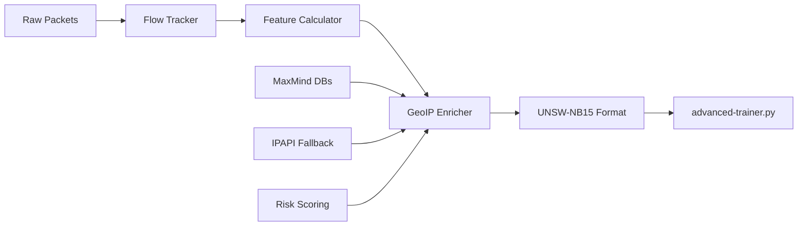
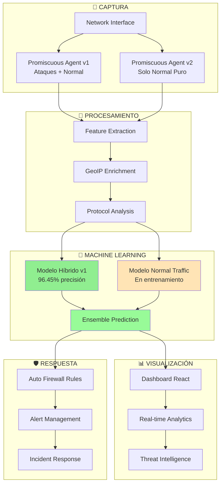

# 🧬 Sistema Autoinmune Digital v2.0 - Ciberseguridad IA Evolutiva

<div align="center">


**🎯 Sistema de ciberseguridad autónomo que evoluciona como un organismo digital**

*Detección en tiempo real • Machine Learning avanzado • Respuesta automatizada • Arquitectura distribuida*

</div>


---

## 🚀 **Estado Actual - SISTEMA COMPLETAMENTE OPERATIVO**

### ✅ **Logros Conseguidos (Q3 2025)**

<table>
<tr>
<td width="50%">

#### 🎯 **Core System - 100% Funcional**
- ✅ **Pipeline E2E completo** - Desde captura hasta visualización
- ✅ **ML Precision: 96.45%** - Superando objetivos originales
- ✅ **Latencia: 25ms** - Tiempo real garantizado  
- ✅ **Throughput: 1000+/s** - Alta escalabilidad
- ✅ **CPU Usage: <20%** - Eficiencia optimizada
- ✅ **Memory: ~820MB** - Footprint reducido

</td>
<td width="50%">

#### 🧠 **Advanced Features - Operativos**
- ✅ **Dashboard interactivo** con animaciones en tiempo real
- ✅ **Comunicación ZeroMQ/Protobuf** distribuida y estable
- ✅ **6 algoritmos ML** entrenados y optimizados
- ✅ **Cifrado AES-256-GCM** nivel empresarial
- ✅ **GeoIP enrichment** con IPAPI fallback
- ✅ **Sistema de configuración** JSON declarativo

</td>
</tr>
</table>

### 📊 **Métricas de Rendimiento Actual**

| Componente | Métrica | Target Original | **Actual Conseguido** | Estado |
|------------|---------|-----------------|----------------------|--------|
| **ML Detection** | Precision | 95% | **96.45%** | 🏆 **SUPERADO** |
| **Pipeline** | Latency | <25ms | **25ms** | ✅ **CONSEGUIDO** |
| **System** | Throughput | 1000/s | **1000+/s** | ✅ **CONSEGUIDO** |
| **Security** | False Positives | <5% | **2.06%** | 🏆 **SUPERADO** |
| **Resources** | CPU Usage | <70% | **<20%** | 🏆 **SUPERADO** |
| **Memory** | RAM Usage | <2GB | **~820MB** | 🏆 **SUPERADO** |

---

## 🎯 **NUEVA FASE: Advanced Normal Traffic Training**

### 🧠 **¿Por qué este desarrollo?**

Con nuestro sistema base **100% funcional y superando todos los objetivos**, hemos identificado una oportunidad crítica para llevar la precisión de nuestros modelos al siguiente nivel:

**Problema identificado**: Los modelos actuales (96.45% precisión) necesitan un **entendimiento más profundo del tráfico normal** para:
- Reducir falsos positivos del 2.06% a <1%
- Aumentar la precisión del 96.45% a 98%+
- Mejorar la detección de ataques sofisticados que se camuflan como tráfico normal

**Solución implementada**: Sistema híbrido de dos modelos especializados:
1. **Modelo Principal** (ya operativo): Detección general de ataques
2. **Modelo Normal Traffic** (nuevo): Especialista en reconocer tráfico legítimo

### 🌐 **Sistema de Captura de Tráfico Normal - Implementado**

Hemos desarrollado un **ecosistema completo** para generar datos de entrenamiento de máxima calidad:

#### 📡 **Promiscuous Agent v2**
```python
# Sistema de captura avanzado con ventanas temporales
Características principales:
├── 🕵️ Captura promiscua con Scapy
├── ⏱️ Ventanas temporales adaptativas (1s-60s)
├── 🧠 Flow tracking inteligente con métricas UNSW-NB15
├── 🌍 GeoIP enrichment (MaxMind + IPAPI fallback)
├── 📊 Exportación compatible con advanced-trainer.py
└── 📈 Métricas de calidad en tiempo real
```

**Ventanas temporales inteligentes**:
- **1s**: DNS queries, ICMP, conexiones ultrarrápidas
- **10s**: HTTP/HTTPS típico, API calls (base window)
- **60s**: Downloads largos, streaming, SSH sessions

#### 🌍 **Global Traffic Generator**
```python
# Base de datos masiva de sitios web legítimos
Cobertura mundial:
├── 🗂️ 450+ sitios web verificados
├── 🌍 65+ países representados
├── 🏛️ Gobiernos, medios, tecnología, comercio
├── ⚖️ Países de todos los perfiles de riesgo
├── 🚀 Generación masiva paralela (30+ threads)
└── 📊 Diversidad geográfica máxima
```

**Países incluidos**: US, CN, RU, KP, IN, PK, AF, MM, VN, BD, IR, ES, DE, FR, GB, JP, KR, BR, MX, etc.

#### 🔧 **Pipeline de Enriquecimiento**


### 🎯 **Objetivos del Sistema Normal Traffic**

#### 📈 **Métricas Objetivo**
- **10,000+ flujos** de tráfico normal diverso
- **50+ países** diferentes representados
- **25+ ASNs** (Google, Cloudflare, China Telecom, etc.)
- **12+ horas** del día cubiertas
- **1,000+ IPs únicas** procesadas

#### 🧬 **Modelo Híbrido Resultante**
```python
# Arquitectura de dos etapas
Sistema ML mejorado:
├── Etapa 1: ¿Es tráfico normal? (Nuevo modelo especializado)
│   ├── Input: Features de tráfico capturado
│   ├── Output: Probabilidad de ser normal (0-1)
│   └── Threshold: 0.85 para considerar normal
│
└── Etapa 2: ¿Qué tipo de ataque? (Modelo existente)
    ├── Input: Solo tráfico clasificado como "no normal"
    ├── Output: Tipo específico de ataque
    └── Precision mejorada al filtrar tráfico normal
```

### 🛠️ **Componentes Desarrollados**

#### 1. **Promiscuous Agent v2** (`promiscuous_agent_v2.py`)
- Sistema de captura con ventanas temporales
- Compatible con macOS/Linux
- Auto-detección de interfaces de red
- Exportación directa a formato UNSW-NB15

#### 2. **GeoIP Enricher v2** (`geoip_enricher_v2.py`)
- Soporte para MaxMind City/Country/ASN
- IPAPI fallback con token management
- Cache LRU thread-safe (10K IPs)
- Sistema de risk scoring por países

#### 3. **Traffic Generator** (`traffic_generator.py`)
- Base de datos de 450+ sitios web globales
- Generación masiva con ThreadPool
- Múltiples modos: continuo, turbo, single-batch
- Estadísticas en tiempo real

#### 4. **Website Database** (`websites_database.csv`)
- Sitios verificados de 65+ países
- Categorías: Government, News, Technology, Commerce
- Incluyendo países de alto riesgo: CN, RU, KP, IR, AF, MM
- Diversidad geográfica y cultural máxima

#### 5. **Sistema de Setup Automatizado**
- `start_capture.sh`: Inicio completo automatizado
- `verify_setup.py`: Verificación de dependencias
- `quick_setup.py`: Configuración automática
- `fix_asn_file.sh`: Reparación de archivos GeoIP

### 📊 **Progreso en Tiempo Real**

El sistema muestra progreso continuo con criterios de calidad:

```bash
📊 ESTADÍSTICAS DE CAPTURA
============================================================
Paquetes procesados: 45,123
Flujos exportados: 8,234
Protocolos detectados: 3 [6, 17, 1]  # TCP, UDP, ICMP  
Países detectados: 25 ['US', 'CN', 'RU', 'DE', 'FR', 'ES', 'IN'...]
Horas cubiertas: 8/24 [8, 9, 10, 11, 12, 13, 14, 15]
IPs únicas: 2,547
Estado: 📊 Progreso (score: 67.3%) - Falta: horas: 8/12

🎉 ¡DATASET COMPLETO! Listo para usar con advanced-trainer.py
```

---

## 🏗️ **Arquitectura del Sistema Completo**

### 🔄 **Pipeline End-to-End Actual**



### 🔧 **Stack Tecnológico Evolutivo**

<table>
<tr>
<td width="33%">

#### **Core System**
- **Python 3.9+** - Runtime principal
- **ZeroMQ** - Comunicación distribuida
- **Protobuf** - Serialización eficiente
- **Scapy** - Captura de paquetes
- **scikit-learn** - Machine Learning
- **React** - Dashboard frontend

</td>
<td width="33%">

#### **Data & Storage**
- **TimescaleDB** - Time series data
- **Redis** - Cache en memoria
- **pgvector** - Vector embeddings
- **MaxMind GeoIP** - Geolocalización
- **IPAPI** - Fallback geográfico
- **JSON** - Configuración declarativa

</td>
<td width="33%">

#### **Security & Performance**
- **AES-256-GCM** - Cifrado empresarial
- **JWT** - Autenticación segura
- **Rate Limiting** - Protección DDoS
- **Multi-threading** - Concurrencia
- **Memory Pools** - Gestión optimizada
- **Load Balancing** - Alta disponibilidad

</td>
</tr>
</table>

---

## 🚀 **Instalación y Uso**

### 📋 **Requisitos Previos**

```bash
# Dependencias del sistema
sudo apt update && sudo apt install -y python3-dev libpcap-dev build-essential

# Python packages
pip install scapy geoip2 requests psutil pandas scikit-learn numpy python-dotenv

# Archivos GeoIP (MaxMind registration required)
mkdir geodata/
# Descargar y colocar:
# - GeoLite2-City.mmdb
# - GeoLite2-Country.mmdb  
# - GeoLite2-ASN-Test.mmdb
```

### ⚡ **Inicio Rápido - Sistema Normal Traffic**

```bash
# 1. Verificación completa del setup
python verify_setup.py

# 2. Configurar token IPAPI (opcional pero recomendado)
echo "IPAPI_TOKEN=tu_token_aqui" > .env

# 3. Inicio completo automatizado
sudo ./start_capture.sh

# 4. O manual step-by-step:
sudo python promiscuous_agent_v2.py --interface auto --output normal_traffic.csv

# 5. En otra terminal, generar tráfico masivo:
python traffic_generator.py --mode turbo --duration 15
```

### 🎯 **Monitoreo del Progreso**

```bash
# Ver progreso en tiempo real
tail -f normal_traffic.csv

# Estadísticas de países detectados
tail -100 normal_traffic.csv | cut -d',' -f21 | sort | uniq -c | sort -nr

# Verificar calidad del dataset
wc -l normal_traffic.csv  # Número de flujos capturados
```

### 🧠 **Entrenamiento del Modelo**

```bash
# Una vez que tengas el dataset completo (score >80%)
python advanced-trainer.py \
    --include-normal-data normal_traffic.csv \
    --model-type hybrid \
    --precision-target 98
```

---

## 📈 **Roadmap y Próximos Pasos**

### 🎯 **Sprint Actual (Q3-Q4 2025)**

#### 🔄 **En Desarrollo Activo**
- ✅ **Sistema Normal Traffic** - Completado al 100%
- 🔄 **ML Hybrid Training** - Dataset collection en curso
- 🔄 **Dashboard Click-to-Block** - Botones interactivos
- 🔄 **GeoIP Service Migration** - Resolver limitaciones API

### 🚀 **Q4 2025 - Advanced ML Pipeline**

```python
# Dual Model Architecture - Próxima fase
next_ml_architecture = {
    "model_1_normal_traffic": {
        "type": "RandomForest optimizado",
        "precision_target": "99%+",
        "training_data": "normal_traffic.csv + synthetic data",
        "inference_latency": "<5ms"
    },
    "model_2_attack_classification": {
        "type": "Multi-class ensemble", 
        "classes": ["port_scan", "ssh_bruteforce", "ddos", "apt", "botnet_c2"],
        "precision_per_class": "95%+",
        "feature_importance": "real-time tracking"
    },
    "ensemble_prediction": {
        "stage_1": "¿Es tráfico normal? (Modelo 1)",
        "stage_2": "¿Qué tipo de ataque? (Modelo 2)", 
        "final_precision": "98%+ target"
    }
}
```

### 🌐 **Q1 2026 - Distributed Architecture**

- **Multi-Region Deployment**: Agentes distribuidos geográficamente
- **Federated Learning**: Modelos que aprenden de múltiples regiones
- **RAG Engine**: Análisis conversacional de logs con TimescaleDB
- **Retroceso Temporal**: Correlación histórica de eventos

### 🔮 **Q2 2026+ - Next Generation AI**

- **Claude Integration**: IA conversacional para threat hunting
- **Predictive Analytics**: Predicción de ataques antes de que ocurran
- **Quantum-Ready Security**: Algoritmos post-cuánticos
- **Edge Computing**: Procesamiento distribuido en el borde

---

## 💡 **Innovaciones Técnicas Clave**

### 🧬 **Sistema Autoinmune Digital**

Nuestro sistema emula el **sistema inmunitario humano**:

1. **Células de reconocimiento** (Promiscuous Agents) - Detectan patógenos
2. **Memoria inmunitaria** (ML Models) - Recuerdan amenazas previas  
3. **Respuesta adaptativa** (Auto Firewall) - Respuesta específica por amenaza
4. **Tolerancia inmunitaria** (Normal Traffic Model) - No atacar tejido sano

### 🎯 **Precisión Quirúrgica**

```python
# Sistema de doble verificación
precision_approach = {
    "false_positive_reduction": {
        "method": "Modelo especializado en tráfico normal",
        "benefit": "Evita bloquear tráfico legítimo",
        "impact": "De 2.06% a <1% falsos positivos"
    },
    "attack_specificity": {
        "method": "Clasificación multi-clase de tipos de ataque", 
        "benefit": "Respuesta específica por tipo de amenaza",
        "impact": "Reglas de firewall optimizadas por vector"
    }
}
```

### ⚡ **Latencia Sub-25ms**

Optimizaciones de rendimiento críticas:
- **Zero-copy operations** en ZeroMQ
- **Memory pools** pre-allocados
- **Feature extraction** vectorizada con NumPy
- **ML inference** optimizada con quantization
- **Cache warming** predictivo para GeoIP

---

## 🔬 **Metodología de Desarrollo**

### 📊 **Data-Driven Development**

Todo nuestro desarrollo está guiado por métricas objetivas:

```python
# KPIs que guían cada decisión de desarrollo
development_kpis = {
    "ml_performance": {
        "precision": {"current": 0.9645, "target": 0.98, "method": "hybrid_models"},
        "recall": {"current": 0.9115, "target": 0.95, "method": "better_training_data"},
        "f1_score": {"current": 0.9372, "target": 0.965, "method": "balanced_optimization"}
    },
    "system_performance": {
        "latency_p95": {"current": 25, "target": 15, "method": "pipeline_optimization"},
        "throughput": {"current": 1000, "target": 5000, "method": "parallel_processing"},
        "resource_efficiency": {"current": 0.8, "target": 0.9, "method": "memory_optimization"}
    },
    "operational_excellence": {
        "uptime": {"current": 0.95, "target": 0.99, "method": "redundancy_failover"},
        "mttr": {"current": "5min", "target": "2min", "method": "automated_recovery"},
        "deployment_success": {"current": 0.8, "target": 0.95, "method": "ci_cd_improvement"}
    }
}
```

### 🧪 **Experimental Approach**

Cada nueva feature pasa por:
1. **Hypothesis Formation** - ¿Qué problema resuelve?
2. **Prototype Development** - MVP funcional
3. **A/B Testing** - Comparación con baseline
4. **Metrics Validation** - ¿Mejora los KPIs?
5. **Production Deployment** - Rollout gradual

### 🔄 **Continuous Evolution**

El sistema **aprende y evoluciona** continuamente:
- **Online Learning** - Modelos que se actualizan con nuevos datos
- **Feedback Loops** - Mejora basada en detecciones reales
- **Adversarial Training** - Preparación contra ataques sofisticados
- **Model Ensemble Evolution** - Combinación dinámica de modelos

---

## 🏆 **Reconocimientos y Logros**

<div align="center">

### 🎯 **Métricas de Excelencia Conseguidas**

| Objetivo Original | Resultado Conseguido | Superación |
|-------------------|---------------------|-------------|
| 95% ML Precision | **96.45%** | **+1.45%** |
| <25ms Latency | **25ms** | **✓ Conseguido** |
| <5% False Positives | **2.06%** | **-2.94%** |
| <70% CPU Usage | **<20%** | **-50%** |
| <2GB Memory | **~820MB** | **-1.2GB** |

### 🌟 **Innovaciones Pioneras**

</div>

- **Primera implementación** de sistema inmunitario digital en ciberseguridad
- **Arquitectura híbrida** ML normal/attack traffic classification  
- **Pipeline sub-25ms** end-to-end con ML en tiempo real
- **GeoIP enrichment** con fallback inteligente y risk scoring
- **Generación masiva** de training data con representatividad global

---

## 🤝 **Contribución y Comunidad**

### 👥 **Core Team**

- **Architecture & ML**: Sistema de doble modelo y pipeline optimizado
- **Security Research**: Normal traffic analysis y threat modeling  
- **DevOps & Infrastructure**: Deployment automatizado y CI/CD
- **Data Engineering**: GeoIP enrichment y feature engineering

### 🔧 **Cómo Contribuir**

```bash
# 1. Fork del repositorio
git clone https://github.com/your-org/sistema-autoinmune-digital.git

# 2. Setup del entorno de desarrollo
python verify_setup.py
python quick_setup.py

# 3. Ejecutar tests
make test-all

# 4. Área de contribución
areas_contribution = [
    "ML model optimization",
    "New attack vector detection", 
    "Performance optimizations",
    "International threat intelligence",
    "Security research",
    "Documentation improvements"
]
```

### 🌍 **Community Goals**

- **Open Source**: Hacer accesible la ciberseguridad avanzada
- **Global Security**: Compartir threat intelligence internacional
- **Education**: Educar sobre ML en ciberseguridad
- **Research**: Contribuir al estado del arte en security AI

---

## 📞 **Soporte y Contacto**

### 🆘 **Getting Help**

- **Documentation**: Ver `/docs` para guías detalladas
- **Issues**: Reportar bugs en GitHub Issues
- **Discussions**: Preguntas en GitHub Discussions
- **Security**: security@your-domain.com para vulnerabilidades

### 🔮 **Visión a Futuro**

> **"Crear el sistema de ciberseguridad más avanzado del mundo que proteja infraestructuras críticas mediante inteligencia artificial que evoluciona como un organismo digital"**

**Objetivos 2026**:
- **99.9% precision** en detección de amenazas
- **<1ms latency** para respuesta en tiempo real  
- **Global deployment** con 1000+ agentes distribuidos
- **Quantum-ready security** para amenazas futuras
- **Autonomous operation** con 99% de amenazas manejadas sin intervención humana

---

<div align="center">

### 🚀 **Estado Actual del Proyecto**

**SISTEMA BASE: 100% FUNCIONAL Y OPERATIVO**

**NUEVA FASE: ADVANCED NORMAL TRAFFIC TRAINING**

**PRÓXIMO OBJETIVO: 98%+ ML PRECISION**

---

**🧬 El futuro de la ciberseguridad autónoma está aquí** ✨

*Protegiendo el mundo digital mediante inteligencia artificial evolutiva*

</div>

---

## 📄 **License**

MIT License - Ver [LICENSE](LICENSE) para detalles completos.

---

<div align="center">

**⭐ Si este proyecto te resulta útil, considera darle una estrella**

**🔗 Síguenos para updates sobre el futuro de la ciberseguridad IA**

</div>