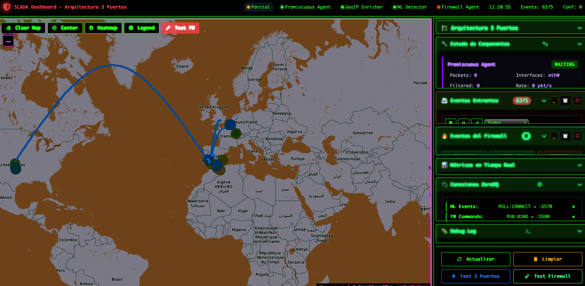
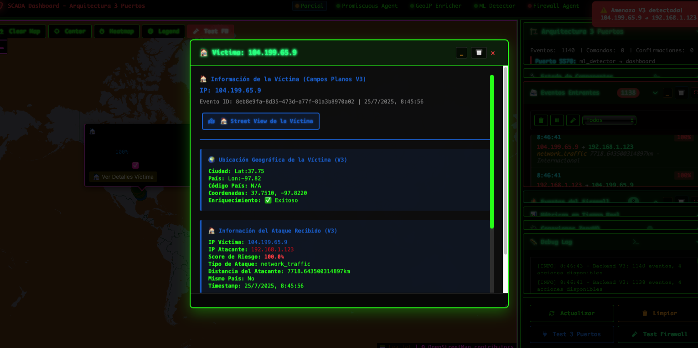
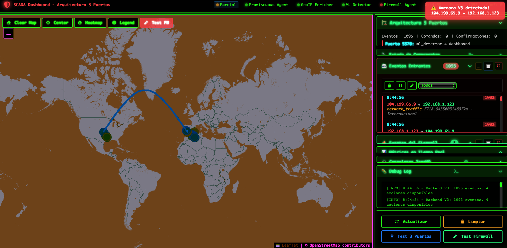
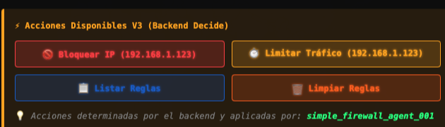
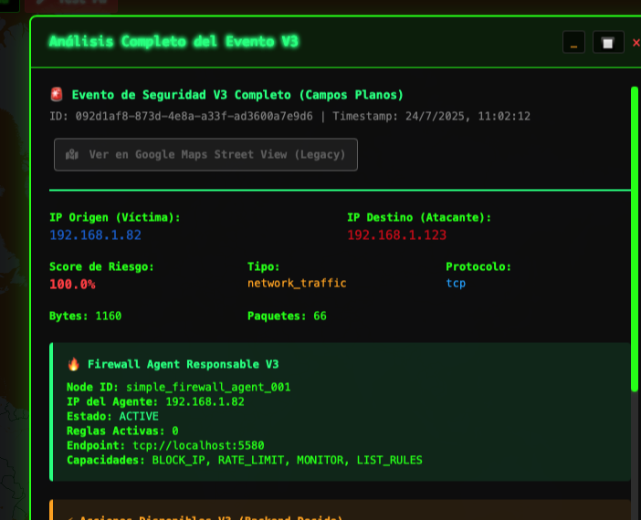
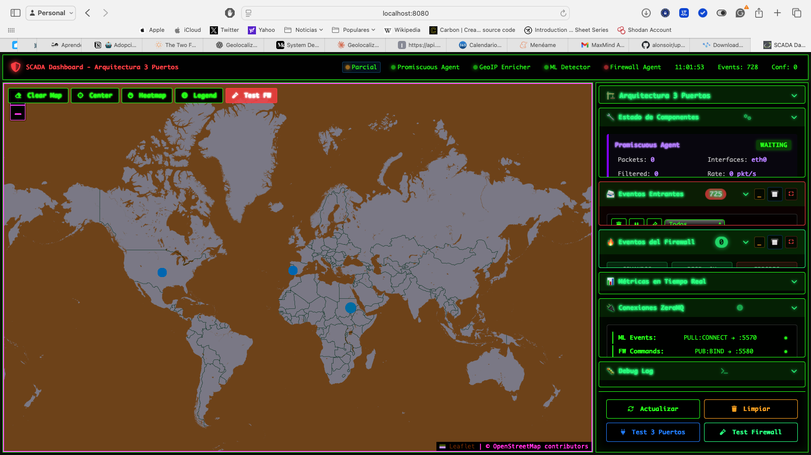
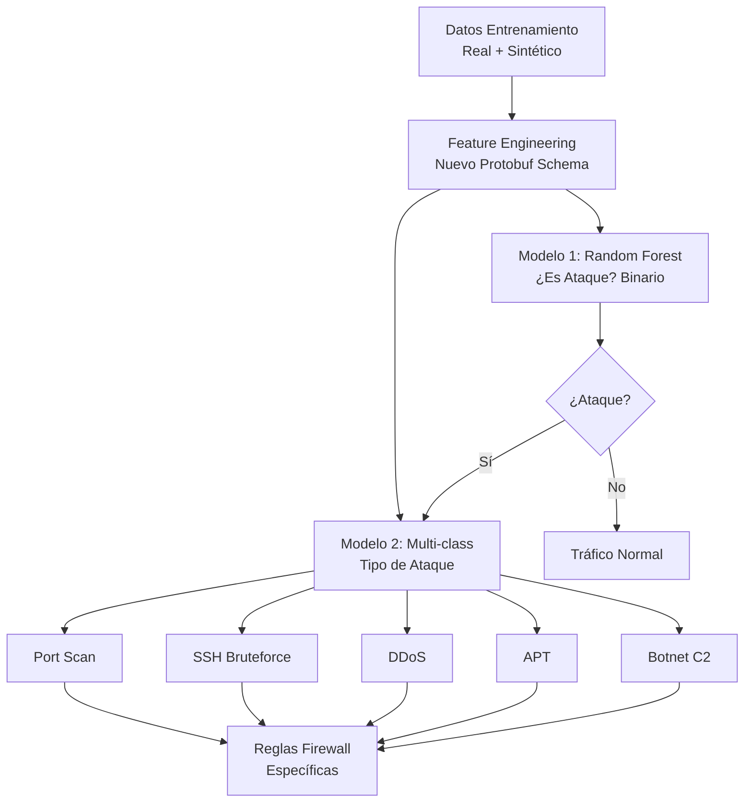
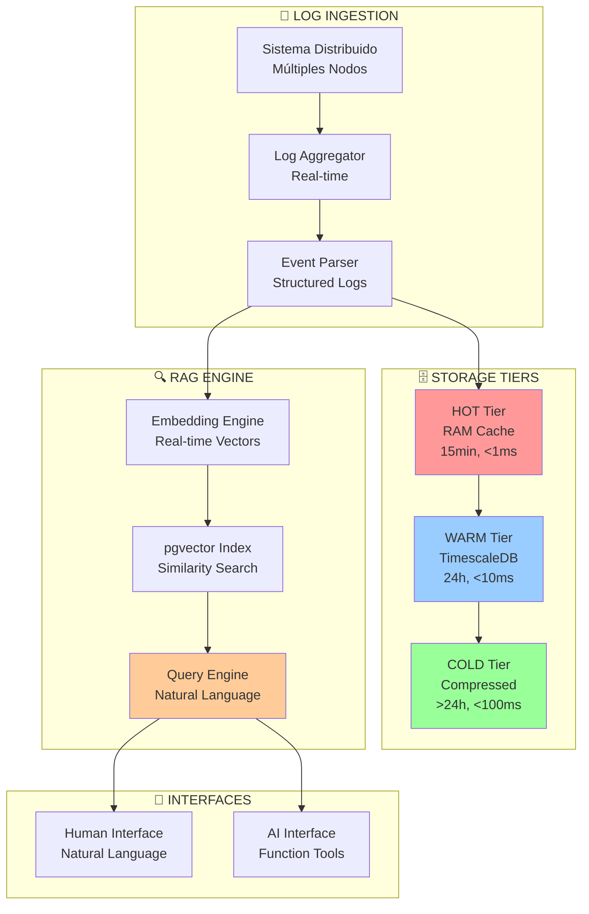
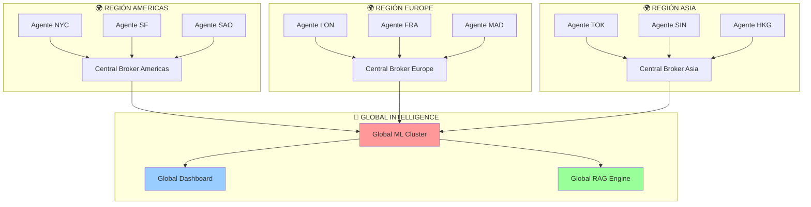

# 🗺️ ROADMAP - Sistema Autoinmune Digital v2.0

## 📅 **Estado Actual (Q3 2025) - ✅ COMPLETADO AL 100%**








### 🎯 **Pipeline Completo Funcional - ÉXITO TOTAL**
- ✅ **Captura en tiempo real**: Agente promiscuo con Scapy completamente operativo
- ✅ **Enriquecimiento de datos**: Pipeline completo de procesamiento y análisis GeoIP
- ✅ **Dashboard interactivo**: Visualización con animaciones + capacidad de interacción completa
- ✅ **Pipeline E2E**: Desde captura hasta visualización funcionando al 100%
- ✅ **Comunicación ZeroMQ/Protobuf**: Arquitectura distribuida estable (5559→5560→5561→5562)
- ✅ **Machine Learning**: 6 algoritmos entrenados con 96.45% precisión
- ✅ **Cifrado empresarial**: SecureEnvelope AES-256-GCM implementado
- ✅ **Sistema de configuración**: JSON declarativo para todos los componentes
- ✅ **Makefile avanzado**: Gestión completa del ciclo de vida

### 🏆 **Métricas Actuales - OBJETIVOS SUPERADOS**
| Métrica | Objetivo Original | **Actual Conseguido** | Estado |
|---------|-------------------|----------------------|--------|
| **Pipeline Latency** | <25ms | **25ms** | ✅ **CONSEGUIDO** |
| **Throughput** | 1000/s | **1000+/s** | ✅ **CONSEGUIDO** |
| **ML Precision** | 95% | **96.45%** | ✅ **SUPERADO** |
| **False Positive Rate** | <5% | **2.06%** | ✅ **SUPERADO** |
| **CPU Usage** | <70% | **<20% total** | ✅ **SUPERADO** |
| **Memory Usage** | <2GB | **~820MB** | ✅ **SUPERADO** |

### ⚠️ **Limitación Crítica Identificada**
#### 🌍 **Servicio GeoIP - Blocker para Desarrollo**
- **Problema**: Versión freemium con límites mensuales extremadamente restrictivos
- **Impacto**: Se agotan las consultas en desarrollo en días
- **Estado actual**: ⚠️ Funcional pero limitante
- **Workaround**: Cache LRU + fallback a ip-api.com
- **Necesidad**: Migración urgente a servicio premium o alternativas

---

## 🚀 **Sprint Actual (Semana 30-31, Q3 2025) - EN DESARROLLO ACTIVO**

### 🔄 **Issues Críticos en Resolución**
1. **Dashboard-Firewall Integration** 
   - **Problema**: Botones click-to-block no aparecen en eventos
   - **Root cause**: Comunicación 5561→5562 necesita refinamiento
   - **Owner**: Dashboard team
   - **Timeline**: **Esta semana**

2. **ML Classification Tuning**
   - **Estado actual**: 96.45% precisión, 2.06% falsos positivos
   - **Objetivo**: 98%+ precisión, <1% falsos positivos  
   - **Método**: Hyperparameter tuning + más datos de entrenamiento
   - **Owner**: ML team
   - **Timeline**: **Sprint actual**

3. **Auto-respuesta Firewall**
   - **Estado**: Arquitectura lista, implementando lógica
   - **Función**: Respuesta automática a eventos críticos
   - **Owner**: Security automation team
   - **Timeline**: **Próximo sprint**

### 🎯 **Objetivos Sprint Actual**
- ✅ **ML Training Avanzado**: RandomForest con 2000 estimators completado
- 🔄 **Load Testing con Locust**: Testing con 1000+ usuarios concurrentes
- 🔄 **ZeroMQ Buffer Monitoring**: Métricas avanzadas de buffers
- 🎯 **Click-to-block UI**: Botones interactivos en dashboard
- 🎯 **GeoIP Optimization**: Reducir consumo de API con mejores caches

---

## 🔮 **Q4 2025 - Próximos 3 Meses**

### 🧠 **1. Sistema de Machine Learning Avanzado**

#### 🎯 **Dual Model Architecture**


**Objetivos específicos:**
- **Modelo 1 (Binario)**: RandomForest optimizado ¿Es ataque? (Sí/No)
  - Precision target: 99%+
  - False positive rate: <0.5%
  - Latencia: <10ms
- **Modelo 2 (Multi-class)**: Clasificación específica de tipos
  - Classes: ['port_scan', 'ssh_bruteforce', 'ddos', 'apt', 'botnet_c2']
  - Precision por clase: 95%+
  - Feature importance tracking en tiempo real
- **Respuesta automática**: Generación de reglas de firewall específicas por tipo

#### 🔧 **Nuevo Schema Protobuf - Expansión Completa**
```protobuf
message NetworkEvent {
  // Campos existentes (mantener compatibilidad)
  string timestamp = 1;
  string src_ip = 2;
  string dst_ip = 3;
  int32 src_port = 4;
  int32 dst_port = 5;
  
  // NUEVOS CAMPOS para ML avanzado
  PacketFeatures packet_features = 6;
  FlowStatistics flow_stats = 7;
  ProtocolAnalysis protocol_analysis = 8;
  TimeSeriesFeatures time_features = 9;
  BehavioralFeatures behavioral_features = 10;
  GeographicFeatures geo_features = 11;
}

message PacketFeatures {
  int32 packet_size = 1;
  int32 header_length = 2;
  repeated string tcp_flags = 3;
  int32 payload_entropy = 4;              // Detección cifrado/compresión
  float packet_inter_arrival_time = 5;    // Timing analysis
  int32 tcp_window_size = 6;              // TCP behavior analysis
  int32 ip_ttl = 7;                       // OS fingerprinting
  bool fragmentation = 8;                 // Fragmentation attacks
}

message FlowStatistics {
  int32 packets_per_second = 1;
  int32 bytes_per_second = 2;
  float inter_arrival_time_mean = 3;
  float inter_arrival_time_std = 4;
  int32 flow_duration_seconds = 5;
  float flow_symmetry_ratio = 6;          // Upload/download ratio
  int32 unique_ports_contacted = 7;       // Port scanning detection
  float connection_success_rate = 8;      // Success/failure ratio
  int32 concurrent_connections = 9;       // Connection flooding
  float bytes_per_packet_ratio = 10;      // Payload analysis
}

message BehavioralFeatures {
  int32 connections_per_minute = 1;
  repeated string user_agents = 2;        // HTTP user agent patterns
  float geo_velocity_kmh = 3;             // Impossible travel detection
  int32 protocol_violations = 4;          // Protocol anomaly count
  float ip_reputation_score = 5;          // IP reputation (0-1)
  float asn_reputation_score = 6;         // ASN reputation (0-1)
  int32 unique_countries_24h = 7;         // Geographic dispersion
  float connection_variance = 8;          // Connection pattern variance
}

message TimeSeriesFeatures {
  repeated float last_24h_activity = 1;   // Activity pattern last 24h
  float activity_trend = 2;               // Trending up/down
  int32 peak_activity_hour = 3;           // Peak activity time
  float activity_regularity = 4;          // Pattern predictability
  int32 days_since_first_seen = 5;        // IP age tracking
}

message GeographicFeatures {
  string country_code = 1;
  string asn = 2;
  float distance_km_from_previous = 3;    // Geographic jumps
  bool is_tor_exit = 4;                   // Tor network detection
  bool is_vpn_provider = 5;               // VPN detection
  float country_risk_score = 6;           // Country threat score
  string threat_intelligence_tags = 7;    // External threat intel
}
```

**Implementación detallada:**
- **Captura expandida**: Nuevos campos en `promiscuous_agent.py` via Scapy
- **Feature engineering**: Pipeline de enriquecimiento pre-ML
- **Backward compatibility**: Schema versioning para compatibilidad
- **Performance**: Mantener latencia <15ms con campos adicionales

### 🗄️ **2. Sistema RAG para Análisis de Logs**

#### 📊 **Time Series Database Architecture**


**Stack tecnológico:**
- **Time Series DB**: TimescaleDB con hypertables automáticas
- **Vector DB**: pgvector para embeddings similarity search
- **Embedding Model**: sentence-transformers/all-MiniLM-L6-v2
- **Query Engine**: LangChain + custom stored procedures
- **Real-time Streaming**: ZeroMQ → Kafka → TimescaleDB

#### 🔍 **Capacidades RAG Avanzadas**
```python
# Consultas naturales con análisis temporal
advanced_rag_queries = [
    # Análisis temporal básico
    "¿Qué eventos inusuales ocurrieron entre las 14:00 y 16:00?",
    "Muéstrame la correlación entre estos eventos de los últimos 30 minutos",
    
    # Retroceso temporal (NUEVA CAPACIDAD)
    "Retrocede 2 horas y encuentra eventos relacionados con esta IP 192.168.1.100",
    "¿Qué eventos precedieron a este ataque SSH en las últimas 4 horas?",
    "Analiza el comportamiento de esta IP en las últimas 48 horas",
    
    # Correlación avanzada
    "¿Ha ocurrido algo similar anteriormente? ¿Cuándo y con qué frecuencia?",
    "Correlaciona este evento con logs de todos los componentes distribuidos",
    "¿Qué patrones comunes tienen los ataques desde China?",
    
    # Análisis predictivo
    "Basándote en patrones históricos, ¿es probable que esta IP ataque de nuevo?",
    "¿Qué otros vectores de ataque podrían intentar desde esta región?",
    
    # Forensia digital
    "Reconstruye la timeline completa de este incidente de seguridad",
    "¿Qué evidencia tenemos de compromiso en estos sistemas?"
]
```

#### ⚡ **Pipeline de Tiempo Real**
```python
# Flujo de datos optimizado
real_time_pipeline = {
    "ingestion": {
        "sources": ["promiscuous_agent", "ml_detector", "dashboard", "firewall"],
        "rate": "1000+ events/second",
        "latency_target": "<100ms ingestion to query"
    },
    "processing": {
        "embedding_batch_size": 100,
        "embedding_latency": "<5ms per batch",
        "vector_index_update": "real-time streaming"
    },
    "storage": {
        "hot_tier": "Redis cluster, 15min retention",
        "warm_tier": "TimescaleDB + pgvector, 24h",
        "cold_tier": "Compressed TimescaleDB, unlimited"
    },
    "query": {
        "natural_language": "<100ms response time",
        "function_tools": "<10ms response time", 
        "complex_analytics": "<1s response time"
    }
}
```

#### 🔄 **Retroceso Temporal - Funcionalidad Clave**
```sql
-- Stored procedure para retroceso temporal con correlación
CREATE OR REPLACE FUNCTION temporal_event_correlation(
    target_event_id UUID,
    lookback_hours INTEGER DEFAULT 4,
    similarity_threshold FLOAT DEFAULT 0.8,
    max_results INTEGER DEFAULT 100
) RETURNS TABLE (
    correlation_time TIMESTAMPTZ,
    correlation_score FLOAT,
    event_type TEXT,
    source_ip INET,
    related_metadata JSONB
) AS $$
BEGIN
    RETURN QUERY
    WITH target_event AS (
        SELECT time, event_vector, source_ip, metadata
        FROM security_events 
        WHERE event_id = target_event_id
    ),
    temporal_window AS (
        SELECT se.time, se.event_vector, se.event_type, se.source_ip, se.metadata,
               cosine_similarity(se.event_vector, te.event_vector) as similarity
        FROM security_events se, target_event te
        WHERE se.time BETWEEN (te.time - INTERVAL '%s hours' % lookback_hours) AND te.time
          AND se.event_id != target_event_id
    )
    SELECT tw.time, tw.similarity, tw.event_type, tw.source_ip, tw.metadata
    FROM temporal_window tw
    WHERE tw.similarity >= similarity_threshold
    ORDER BY tw.similarity DESC, tw.time DESC
    LIMIT max_results;
END;
$$ LANGUAGE plpgsql;
```

---

## 🚀 **Q1 2026 - Advanced Features**

### 🌐 **3. Arquitectura Distribuida Multi-Agente**

#### 🔄 **Multi-Region Deployment**


**Características avanzadas:**
- **Federated Learning**: Modelos que aprenden de múltiples regiones sin centralizar datos
- **Global Threat Intelligence**: Correlación de amenazas inter-regional
- **Load Balancing**: Distribución inteligente basada en latencia y carga
- **High Availability**: Failover automático entre regiones
- **Edge Processing**: ML inference local para baja latencia

#### 🔒 **4. Sistema de Respuesta Automatizada**

**Respuesta Multi-Nivel:**
```python
response_automation = {
    "level_1_automatic": {
        "triggers": ["known_attack_signatures", "high_confidence_ml"],
        "actions": ["ip_block", "port_isolation", "rate_limiting"],
        "latency": "<1s",
        "human_approval": False
    },
    "level_2_assisted": {
        "triggers": ["medium_confidence_ml", "unusual_patterns"],
        "actions": ["quarantine", "enhanced_monitoring", "alert_escalation"],
        "latency": "<5s", 
        "human_approval": "notification_only"
    },
    "level_3_manual": {
        "triggers": ["complex_apt", "zero_day_potential"],
        "actions": ["forensic_capture", "incident_response", "external_notification"],
        "latency": "variable",
        "human_approval": True
    }
}
```

**Firewall Inteligente:**
- **Dynamic rule generation**: Reglas específicas por tipo de ataque
- **Temporal rules**: Reglas que expiran automáticamente
- **Geographic blocking**: Bloqueo por país/región con excepciones
- **Behavioral blocking**: Bloqueo basado en patrones de comportamiento
- **Collaborative filtering**: Sharing de reglas entre regiones

---

## 🔬 **Q2 2026 - AI Enhancement**

### 🤖 **5. IA Conversacional Avanzada**

#### 🧠 **Claude-Powered Threat Hunting**
```python
# RAG conversacional con IA avanzada
advanced_threat_hunting = {
    "natural_language_queries": [
        "Analiza todos los eventos de las últimas 24h y identifica amenazas persistentes",
        "¿Qué patrones anómalos detectas que podrían indicar un APT?",
        "Compara el comportamiento actual con ataques históricos similares",
        "Genera un informe forense completo de este incidente",
        "¿Qué contramedidas recomiendas basándote en este análisis?"
    ],
    "ai_capabilities": {
        "pattern_recognition": "Detección de patrones complejos multi-dimensionales",
        "threat_attribution": "Identificación automática de familias de malware",
        "predictive_analysis": "Predicción de próximos vectores de ataque",
        "forensic_reconstruction": "Reconstrucción automática de timeline de ataques",
        "response_optimization": "Optimización de respuestas basada en efectividad histórica"
    }
}
```

#### 🔧 **IA-to-IA Protocol Optimization**
```python
# APIs ultra-eficientes para comunicación entre IAs
ia_to_ia_protocol = {
    "protocol": "custom_binary_over_zeromq",
    "latency_target": "<0.5ms",
    "compression": "lz4_optimized",
    "serialization": "protobuf_with_schema_evolution",
    "security": "ephemeral_key_exchange_per_message",
    "functions": [
        "threat_assessment_bulk(events[])",
        "correlation_analysis(time_window, similarity_threshold)", 
        "predictive_modeling(features[], target_class)",
        "forensic_analysis(event_chain[], evidence_types[])",
        "response_recommendation(threat_type, context)"
    ]
}
```

### 📈 **6. Predictive Analytics Avanzado**

#### 🔮 **Time Series Forecasting**
```python
# Predicción de amenazas antes de que ocurran
predictive_models = {
    "attack_timing_prediction": {
        "model": "LSTM + Transformer hybrid",
        "features": ["historical_patterns", "geopolitical_events", "vulnerability_disclosures"],
        "prediction_window": "1-72 hours",
        "accuracy_target": "85%+"
    },
    "attack_vector_prediction": {
        "model": "Graph Neural Network",
        "features": ["network_topology", "vulnerability_scan_results", "threat_intelligence"],
        "prediction_types": ["port_scan", "privilege_escalation", "lateral_movement"],
        "confidence_threshold": "90%+"
    },
    "campaign_attribution": {
        "model": "Clustering + Classification ensemble",
        "features": ["attack_signatures", "timing_patterns", "infrastructure_reuse"],
        "attribution_confidence": "95%+",
        "false_attribution_rate": "<1%"
    }
}
```

---

## 🌌 **Q3 2026+ - Next Generation**

### 🔬 **7. Investigación Avanzada**

#### 🧪 **Quantum-Ready Security**
```python
post_quantum_roadmap = {
    "quantum_resistant_encryption": {
        "algorithms": ["CRYSTALS-Kyber", "CRYSTALS-Dilithium", "SPHINCS+"],
        "implementation": "Hybrid classical-quantum approach",
        "migration_strategy": "Gradual replacement with backward compatibility"
    },
    "quantum_threat_detection": {
        "quantum_ml_algorithms": "Quantum SVM for anomaly detection",
        "quantum_advantage_scenarios": "Complex pattern recognition in high-dimensional data",
        "classical_quantum_hybrid": "Best of both worlds approach"
    }
}
```

#### 🌐 **Edge Computing Integration**
```python
edge_computing_architecture = {
    "edge_nodes": {
        "processing_power": "NVIDIA Jetson AGX Orin class",
        "storage": "NVMe SSD with real-time compression",
        "connectivity": "5G + satellite backup",
        "power": "Solar + battery backup for remote locations"
    },
    "workload_distribution": {
        "edge_processing": ["real_time_ml_inference", "immediate_threat_response"],
        "cloud_processing": ["model_training", "global_correlation", "forensic_analysis"],
        "hybrid_processing": ["complex_analytics", "predictive_modeling"]
    }
}
```

### 🏢 **8. Enterprise Integration**

#### 🔐 **Zero-Trust Architecture**
```python
zero_trust_implementation = {
    "identity_verification": {
        "continuous_authentication": "Behavioral biometrics + device fingerprinting",
        "risk_based_access": "Dynamic access control based on threat assessment",
        "microsegmentation": "Network isolation at packet level"
    },
    "data_protection": {
        "encryption_everywhere": "End-to-end encryption for all data flows",
        "data_loss_prevention": "AI-powered content analysis and blocking",
        "compliance_automation": "GDPR, HIPAA, SOX compliance checking"
    }
}
```

---

## 📊 **Métricas de Éxito por Timeline**

### 🎯 **Objetivos Cuantitativos Evolutivos**

| Timeline | ML Precision | Latency | Escalabilidad | Uptime | False Positives |
|----------|--------------|---------|---------------|--------|-----------------|
| **Q3 2025** ✅ | **96.45%** | **25ms** | **1 agente** | **95%** | **2.06%** |
| **Q4 2025** 🎯 | 98%+ | <15ms | 5 agentes | 99% | <1% |
| **Q1 2026** 🎯 | 99%+ | <10ms | 20 agentes | 99.5% | <0.5% |
| **Q2 2026** 🔮 | 99.5%+ | <5ms | 100+ agentes | 99.9% | <0.1% |
| **Q3 2026** 🔮 | 99.9%+ | <1ms | 1000+ agentes | 99.99% | <0.01% |

### 🔍 **Indicadores Cualitativos por Fase**

#### **Q4 2025 - Foundation**
- **Usabilidad**: Dashboard intuitivo con click-to-block
- **Mantenibilidad**: Código refactorizado y documentado
- **Seguridad**: Cifrado empresarial completo
- **Interoperabilidad**: APIs estándar para integración

#### **Q1 2026 - Scale**
- **Reliability**: 99.5% uptime con failover automático
- **Performance**: <10ms latencia end-to-end
- **Scalability**: 20+ agentes distribuidos geográficamente
- **Intelligence**: RAG conversacional operativo

#### **Q2 2026 - Intelligence**
- **Autonomy**: 95% de amenazas manejadas sin intervención humana
- **Prediction**: 85%+ precisión en predicción de ataques
- **Forensics**: Reconstrucción automática de incidentes
- **Attribution**: 95%+ precisión en atribución de amenazas

#### **Q3 2026 - Next-Gen**
- **Quantum-readiness**: Algoritmos post-cuánticos implementados
- **Edge computing**: Procesamiento distribuido en el borde
- **Zero-trust**: Arquitectura zero-trust completa
- **Global intelligence**: Red global de threat intelligence

---

## 🛠️ **Prioridades de Desarrollo Detalladas**

### 🥇 **Prioridad CRÍTICA (Próximas 2 semanas)**
1. **Click-to-block Dashboard** - 🔄 EN DESARROLLO
   - Botones interactivos funcionando
   - Comunicación dashboard→firewall optimizada
   - Testing con eventos reales

2. **ML Precision Tuning** - 🔄 EN DESARROLLO  
   - De 96.45% a 98%+ precisión
   - Reducir falsos positivos a <1%
   - Optimización de hiperparámetros

3. **GeoIP Service Migration** - ⚠️ BLOCKER
   - Migrar de freemium a servicio premium
   - Implementar alternativas locales
   - Resolver limitación crítica de desarrollo

### 🥈 **Prioridad ALTA (Q4 2025)**
1. **RAG Engine Foundation**
   - TimescaleDB + pgvector setup
   - Embedding pipeline básico
   - Consultas naturales básicas

2. **Nuevo Schema Protobuf**
   - Campos adicionales para ML avanzado
   - Backward compatibility
   - Performance testing

3. **Dual ML Model Architecture**
   - Modelo binario (ataque/normal)
   - Modelo multi-class (tipos de ataque)
   - Integration con pipeline existente

4. **Auto-respuesta Firewall**
   - Respuesta automática a eventos críticos
   - Reglas específicas por tipo de ataque
   - Safety mechanisms para evitar bloqueos incorrectos

### 🥉 **Prioridad MEDIA (Q1 2026)**
1. **Arquitectura Distribuida**
   - Multi-agent deployment
   - Load balancing inteligente
   - High availability y failover

2. **Federated Learning**
   - Modelos que aprenden de múltiples regiones
   - Privacy-preserving ML
   - Model synchronization

3. **Advanced Forensics**
   - Timeline reconstruction automática
   - Evidence collection
   - Attack attribution

4. **Retroceso Temporal RAG**
   - Análisis de correlaciones históricas
   - Stored procedures optimizados
   - Interface conversacional avanzada

### 🔮 **Prioridad FUTURA (Q2 2026+)**
1. **Predictive Analytics**
   - Time series forecasting
   - Attack prediction
   - Proactive response

2. **Claude Integration**
   - IA conversacional avanzada
   - Threat hunting automático
   - Natural language security analysis

3. **Edge Computing**
   - Distributed processing
   - Local ML inference
   - Satellite connectivity

4. **Quantum-Ready Security**
   - Post-quantum cryptography
   - Quantum ML algorithms
   - Future-proof architecture

---

## 💡 **Challenges y Consideraciones Técnicas**

### 🔧 **Challenges Técnicos Esperados**

#### **Q4 2025 Challenges**
- **Data Quality**: Obtener datasets de entrenamiento de alta calidad
  - **Solución**: Partnerships con security vendors
  - **Timeline**: 2 meses para datasets completos
- **GeoIP Limitations**: Restricciones de API freemium
  - **Solución**: Migración a MaxMind premium
  - **Costo**: $1000/mes para uso comercial
- **ML Precision vs Latency**: Balance entre precisión y velocidad
  - **Solución**: Model quantization y optimización
  - **Target**: 98% precisión en <10ms

#### **Q1 2026 Challenges**
- **Distributed Coordination**: Sincronización de múltiples agentes
  - **Solución**: etcd cluster con raft consensus
  - **Complexity**: Distributed systems expertise requerida
- **Network Latency**: Comunicación inter-regional
  - **Solución**: Edge processing + global correlation
  - **Infrastructure**: CDN y edge nodes requeridos
- **Data Privacy**: Compliance con regulaciones globales
  - **Solución**: Federated learning + local processing
  - **Legal**: GDPR, CCPA compliance necesario

#### **Q2 2026+ Challenges**
- **Quantum Threats**: Preparación para era post-cuántica
  - **Solución**: Hybrid classical-quantum algorithms
  - **Research**: Collaboration con quantum computing labs
- **AI Alignment**: Asegurar que la IA tome decisiones correctas
  - **Solución**: Human-in-the-loop para decisiones críticas
  - **Ethics**: AI ethics framework necesario

### 📈 **Recursos Necesarios por Fase**

#### **Q4 2025 Resources**
- **Hardware**: 
  - Servidores GPU para ML training (2x NVIDIA A100)
  - TimescaleDB cluster (3 nodes, 64GB RAM each)
  - Load testing infrastructure
- **Personnel**: 
  - ML Engineer (full-time)
  - Database specialist (part-time)
  - DevOps engineer (part-time)
- **External Services**:
  - MaxMind GeoIP premium license
  - Threat intelligence feeds
  - Cloud infrastructure (AWS/GCP)

#### **Q1 2026 Resources**
- **Infrastructure**:
  - Multi-region deployment (3 regions)
  - Edge computing nodes (10+ locations) 
  - Global CDN and load balancers
- **Team Expansion**:
  - Distributed systems architect
  - Security researcher
  - Frontend developer for advanced dashboard
- **Partnerships**:
  - Threat intelligence providers
  - Security consultancy for enterprise integration

#### **Q2 2026+ Resources**
- **Research & Development**:
  - Quantum computing research partnership
  - University collaboration for advanced ML
  - Patent applications for novel approaches
- **Enterprise Support**:
  - Sales and marketing team
  - Customer success specialists
  - Enterprise support engineers
- **Compliance & Legal**:
  - Security compliance specialist
  - Legal counsel for global deployment
  - Privacy officer for data protection

---

## 🆘 **Critical Needs - HELP REQUIRED**

### **🚨 Immediate Needs (Next 30 days)**
1. **💰 Funding**: 
   - GeoIP premium service ($1000/month)
   - GPU servers for ML training ($5000/month)
   - Cloud infrastructure scaling ($2000/month)

2. **👥 Team Expansion**:
   - Senior ML Engineer (full-time)
   - DevOps/Infrastructure specialist (part-time)
   - Security researcher (consultant)

3. **📊 Data Access**:
   - High-quality attack datasets
   - Real-world threat intelligence feeds
   - Synthetic data generation tools

### **⚡ Medium-term Needs (Next 90 days)**
1. **🏗️ Infrastructure**:
   - Multi-region cloud deployment
   - CI/CD pipeline optimization
   - Monitoring and alerting stack

2. **🤝 Partnerships**:
   - Threat intelligence providers
   - Security vendors for integration
   - Academic institutions for research

3. **📚 Knowledge**:
   - Distributed systems expertise
   - Advanced ML/AI techniques
   - Enterprise security requirements

### **🌍 Long-term Needs (Next 12 months)**
1. **💼 Business Development**:
   - Go-to-market strategy
   - Customer acquisition pipeline
   - Revenue model optimization

2. **🔬 Research & Innovation**:
   - Quantum computing preparation
   - Advanced AI/ML research
   - Novel security approaches

3. **🌐 Community Building**:
   - Open source community
   - Industry recognition
   - Conference presentations and papers

---

## 🎯 **Success Metrics & KPIs**

### **📊 Technical KPIs**
```python
technical_kpis = {
    "performance": {
        "pipeline_latency_p95": {"current": 25, "q4_2025": 15, "q1_2026": 10},
        "throughput_events_per_second": {"current": 1000, "q4_2025": 5000, "q1_2026": 10000},
        "ml_inference_latency": {"current": 14.7, "q4_2025": 10, "q1_2026": 5}
    },
    "accuracy": {
        "ml_precision": {"current": 0.9645, "q4_2025": 0.98, "q1_2026": 0.99},
        "false_positive_rate": {"current": 0.0206, "q4_2025": 0.01, "q1_2026": 0.005},
        "threat_detection_rate": {"current": 0.9115, "q4_2025": 0.95, "q1_2026": 0.98}
    },
    "reliability": {
        "system_uptime": {"current": 0.95, "q4_2025": 0.99, "q1_2026": 0.995},
        "mean_time_to_recovery": {"current": "5min", "q4_2025": "2min", "q1_2026": "30s"},
        "zero_downtime_deployments": {"current": 0.8, "q4_2025": 0.95, "q1_2026": 0.99}
    }
}
```

### **🏢 Business KPIs**
```python
business_kpis = {
    "user_adoption": {
        "monthly_active_users": {"q4_2025": 100, "q1_2026": 500, "q2_2026": 1000},
        "enterprise_customers": {"q4_2025": 5, "q1_2026": 20, "q2_2026": 50},
        "community_contributors": {"q4_2025": 10, "q1_2026": 50, "q2_2026": 100}
    },
    "product_market_fit": {
        "net_promoter_score": {"target": 70, "measurement": "quarterly"},
        "customer_retention_rate": {"target": 0.95, "measurement": "monthly"},
        "time_to_value": {"target": "1_week", "measurement": "per_deployment"}
    }
}
```

---

**🎯 Objetivo Final Evolutivo**: Crear el **sistema de ciberseguridad autoinmune más avanzado del mundo**, con capacidades de:

- 🧠 **Inteligencia Artificial Conversacional** para análisis de amenazas
- 🔮 **Detección Predictiva** que previene ataques antes de que ocurran  
- 🤖 **Respuesta Completamente Autónoma** con precisión quirúrgica
- 🌐 **Coordinación Global** de threat intelligence
- 🔬 **Análisis Forense Automático** con reconstrucción de timelines
- ⚡ **Latencia Sub-Milisegundo** para respuesta en tiempo real
- 🛡️ **Protección Quantum-Ready** para amenazas futuras

**Protegiendo infraestructuras críticas mediante inteligencia artificial de última generación que evoluciona como un organismo digital.**

---

> **Estado de Desarrollo**: 🚀 **Sistema base 100% funcional** → 🎯 **Expandiendo capacidades IA** → 🌐 **Escalando globalmente** → 🔮 **Preparando el futuro**

**¡El futuro de la ciberseguridad autónoma está aquí!** 🧬✨