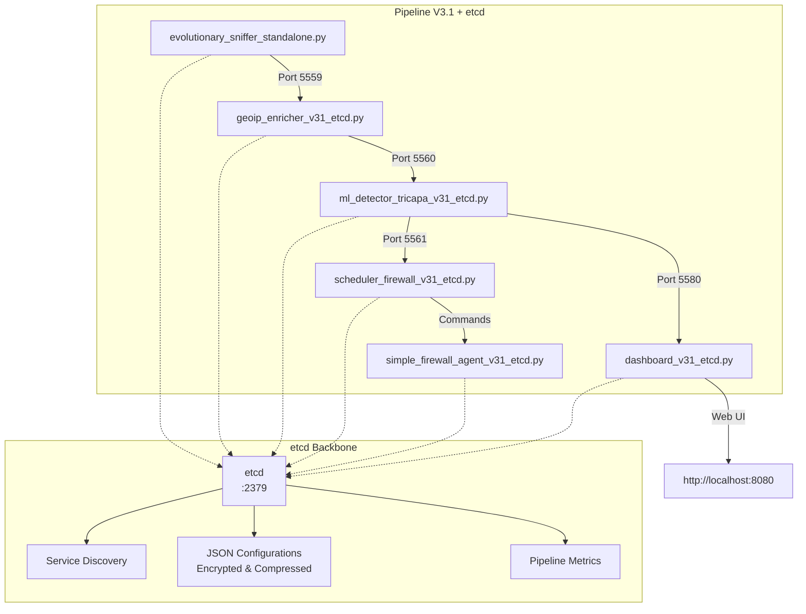
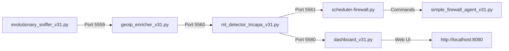
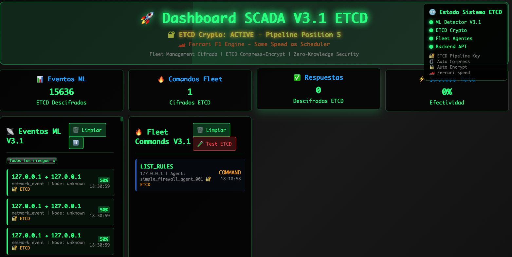
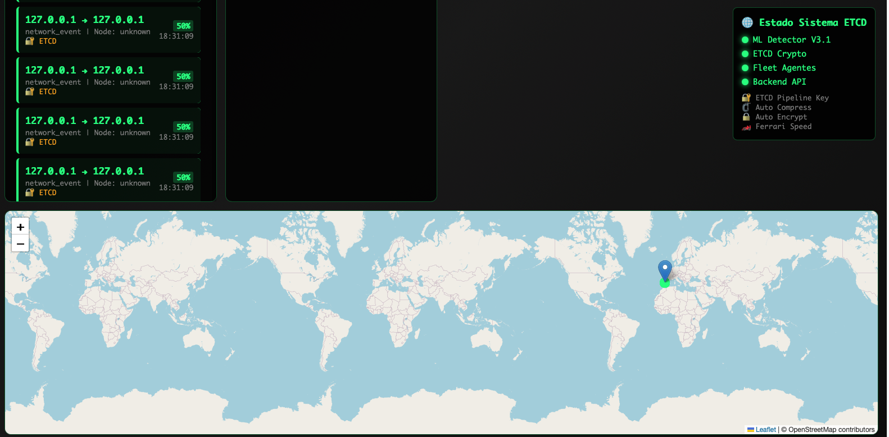

# 🧬 Upgraded Happiness - Sistema Autoinmune Digital V3.1

[](https://github.com/alonsoir/upgraded-happiness)
[](https://github.com/alonsoir/upgraded-happiness)
[](https://github.com/alonsoir/upgraded-happiness)
[](https://github.com/alonsoir/upgraded-happiness)
[](https://github.com/alonsoir/upgraded-happiness)

**Sistema de ciberseguridad adaptativa con IA tricapa, respuesta autónoma en tiempo real y backbone distribuido etcd.**

## 🚀 Estado Actual del Proyecto

### ✅ **V3.1 DISTRIBUTED - Versión con Backbone etcd (ACTUAL)**
**SISTEMA DISTRIBUIDO COMPLETAMENTE OPERATIVO** - Pipeline con etcd como cerebro:
- 🗂️ **etcd Backbone** - Almacenamiento distribuido de configuraciones JSON
- 🔐 **Cifrado y Compresión** - Token cifrado a través de etcd
- 🎯 **Protobuf V3.1** - Esquemas expandidos para DDoS y Ransomware
- 🔄 **Hot Configuration Reload** - Preparado para modificación en caliente
- 🌐 **Service Discovery** - Registro automático de servicios
- 📊 **Dashboard etcd** operativo en `http://localhost:8080`

### ✅ **V3.1 - Versión Evolutiva Original (Compatibilidad)**
**Dashboard V3.1 COMPLETAMENTE FUNCIONAL** - Pipeline completo operativo con:
- 🗺️ **Mapa interactivo** con trayectorias de ataques en tiempo real
- 🎯 **1600+ eventos procesados** sin errores
- 🔥 **Firewall integrado** con botones de acción directa
- 🤖 **ML Tricapa** con 7 modelos operativos
- 📊 **Protobuf V3.1** con campos duales (source/target coordinates)

### 📚 **Demo Inicial** - Versión para Enseñanza/Demostración
Versión estable para mostrar conceptos y arquitectura base.

---

## 🗂️ Arquitectura Distribuida con etcd Backbone

### **Pipeline etcd V3.1 (NUEVO - Recomendado)**

```mermaid
graph TB
    subgraph "etcd Backbone"
        E[etcd<br/>:2379]
        SD[Service Discovery]
        CONFIG[JSON Configurations<br/>Encrypted & Compressed]
        METRICS[Pipeline Metrics]
    end
    
    subgraph "Pipeline V3.1 + etcd"
        A[evolutionary_sniffer_standalone.py] 
        B[geoip_enricher_v31_etcd.py]
        C[ml_detector_tricapa_v31_etcd.py]
        D[scheduler_firewall_v31_etcd.py]
        F[simple_firewall_agent_v31_etcd.py]
        G[dashboard_v31_etcd.py]
    end
    
    A -->|Port 5559| B
    B -->|Port 5560| C
    C -->|Port 5561| D
    D -->|Commands| F
    C -->|Port 5580| G
    G -->|Web UI| H[http://localhost:8080]
    
    A -.-> E
    B -.-> E
    C -.-> E
    D -.-> E
    F -.-> E
    G -.-> E
    
    E --> SD
    E --> CONFIG
    E --> METRICS
```

### **Pipeline Principal V3.1 (Original - Compatibilidad)**

```mermaid
graph LR
    A[evolutionary_sniffer_v31.py] -->|Port 5559| B[geoip_enricher_v31.py]
    B -->|Port 5560| C[ml_detector_tricapa_v31.py]
    C -->|Port 5561| D[scheduler-firewall.py]
    D -->|Commands| E[simple_firewall_agent_v31.py]
    C -->|Port 5580| F[dashboard_v31.py]
    F -->|Web UI| G[http://localhost:8080]
```

### **Componentes V3.1 + etcd**
| Componente | Función | Puerto | Estado | etcd |
|------------|---------|--------|--------|------|
| `evolutionary_sniffer_standalone.py` | Captura avanzada | 5559 | ✅ Operativo | ✅ |
| `geoip_enricher_v31_etcd.py` | Geolocalización dual | 5560 | ✅ Operativo | ✅ |
| `ml_detector_tricapa_v31_etcd.py` | IA tricapa + análisis ML | 5561 | ✅ Operativo | ✅ |
| `scheduler_firewall_v31_etcd.py` | Orquestador distribuido | - | ✅ Operativo | ✅ |
| `simple_firewall_agent_v31_etcd.py` | Agente firewall distribuido | 5562 | ✅ Operativo | ✅ |
| `dashboard_v31_etcd.py` | Dashboard web distribuido | 8080 | ✅ **FUNCIONAL** | ✅ |
| **etcd backbone** | **Cerebro distribuido** | **2379** | ✅ **OPERATIVO** | 🗂️ |

---

## ⚡ Inicio Rápido

### **🗂️ V3.1 DISTRIBUTED - Con Backbone etcd (RECOMENDADO)**
```bash
# Setup completo distribuido
make start-with-etcd-v31

# O paso a paso:
make setup install
make dist-start                    # Iniciar backbone etcd
make start-with-etcd-v31          # Iniciar pipeline + etcd

# Dashboard etcd distribuido
open http://localhost:8080

# Gestión etcd
make etcd-show                     # Ver todo en etcd
make etcd-show-services           # Ver servicios registrados
make dist-ui-open                 # UI web de etcd
```

### **🎯 V3.1 - Versión Evolutiva Original (Compatibilidad)**
```bash
# Setup completo
make quick_v31

# O paso a paso:
make setup install
make start_v31

# Dashboard V3.1
open http://localhost:8080
```

### **📚 Demo Inicial - Para Enseñanza**
```bash
# Versión demo estable
make start

# Dashboard demo
open http://localhost:8080
```

### **🛑 Parada**
```bash
# Parada normal (V3.1 + etcd)
make stop

# Parada completa distribuida
make stop-etcd-v31

# Parada nuclear completa (TODO)
make stop-nuclear-v31
```

---

## 🗂️ Sistema etcd Distribuido

### **🧠 etcd como Cerebro del Sistema**
- **📝 Configuraciones JSON** - Almacenadas en `/config/` con cifrado
- **🔍 Service Discovery** - Registro automático en `/services/`  
- **📊 Métricas** - Telemetría en `/metrics/`
- **🔐 Seguridad** - Tokens cifrados y compresión automática
- **🔄 Hot Reload** - Preparado para modificación en caliente

### **🌐 Gestión Distribuida**
```bash
# Estado del sistema distribuido
make dist-status

# Ver todo en etcd
make etcd-show

# Monitoreo tiempo real
make etcd-watch

# Servicios registrados
make etcd-show-services

# UI web etcd
make dist-ui-open                  # http://localhost:8081
```

### **🔧 Service Discovery**
```bash
# Descubrir servicios
make dist-discover

# Re-registrar servicios
make dist-register

# Test completo
make dist-test
```

---

## 📊 Protobuf V3.1 - Esquemas Expandidos

### **🔴 Nuevos Esquemas para DDoS y Ransomware**
```
protocols/v3_1/
├── network_security_clean_v31.proto      # Esquema principal expandido
├── firewall_commands_v31.proto           # Comandos firewall
├── network_security_clean_v31_pb2.py     # ✅ Precompilado
└── firewall_commands_v31_pb2.py          # ✅ Precompilado
```

### **⚠️ IMPORTANTE - Instalación Protobuf**

**Para compilar esquemas (desarrollo):**
```bash
# macOS - Instalar herramientas protobuf por separado
brew install protobuf                     # Instala protoc compiler

# Verificar instalación
protoc --version                         # Debe mostrar libprotoc 3.21.12+

# Compilar esquemas manualmente
cd protocols/v3_1/
protoc --python_out=. --proto_path=. network_security_clean_v31.proto
protoc --python_out=. --proto_path=. firewall_commands_v31.proto
```

**Para producción:**
- ✅ **Archivos precompilados incluidos** - No necesitas compilar
- ✅ **etcd + protobuf 3.x compatible** - Versiones optimizadas en requirements.txt
- ⚠️ **Versiones diferentes** - Desarrollo necesita tools más recientes que producción

### **🆕 Campos V3.1 Expandidos**
- **DDoS Detection** - Campos específicos para ataques distribuidos
- **Ransomware Analysis** - Metadatos de cifrado malicioso  
- **Coordenadas Duales** - source_latitude/longitude + target_latitude/longitude
- **Node Tracking** - capturing_node_id para trazabilidad distribuida
- **Pipeline Metrics** - Latencias y throughput por componente

---

## 🤖 Sistema ML Tricapa

### **Modelos en Producción**
- **🔴 Nivel 1:** `rf_production_cicids.joblib` - Clasificación CICIDS2017
- **🟡 Nivel 2:** Detectores especializados (web/internal)  
- **🟢 Nivel 3:** Amenazas específicas (DDoS/Ransomware)

### **🆕 Features V3.1 + etcd**
- ✅ **Coordenadas duales** - source_latitude/longitude + target_latitude/longitude
- ✅ **Protobuf V3.1 expandido** - Esquemas DDoS + Ransomware
- ✅ **etcd Configuration** - Configuraciones distribuidas cifradas
- ✅ **Service Discovery** - Registro automático de servicios ML
- ✅ **Ensemble confidence** - Scores de confianza ML mejorados
- ✅ **Pipeline latency tracking** - Monitoreo de rendimiento distribuido
- ✅ **Capturing node ID** - Trazabilidad distribuida

---

## 📊 Dashboard V3.1 - Funcionalidades

### **🗺️ Visualización**
- **Mapa interactivo** con OpenStreetMap + Leaflet
- **Trayectorias animadas** tipo misil entre source → target
- **Marcadores dinámicos** con información detallada
- **Google Maps integration** para vistas detalladas

### **🔥 Firewall Integrado**
- **Botones de acción directa** - Block IP, Rate Limit, etc.
- **Estados en tiempo real** - 1600+ eventos procesados
- **Modales draggables** - UX avanzada
- **Fleet management** - Gestión de múltiples agentes distribuidos

### **📈 Análisis Distribuido**
- **ML Scores en vivo** - Isolation Forest, SVM, LOF
- **Ensemble confidence** - Predicciones consolidadas
- **Pipeline metrics** - Latencia y throughput distribuido
- **Geographic analysis** - Distancias y correlaciones
- **etcd Integration** - Configuraciones en tiempo real

---

## 🔧 Comandos Principales

### **🗂️ Gestión Distribuida (etcd)**
```bash
# Sistema distribuido completo
make start-with-etcd-v31         # Iniciar pipeline + etcd (RECOMENDADO)
make status-etcd-v31             # Estado sistema distribuido
make logs-etcd-v31               # Logs sistema distribuido
make stop-etcd-v31               # Parada distribuida

# Gestión etcd
make etcd-show                   # Ver todo en etcd
make etcd-show-services          # Servicios registrados
make etcd-watch                  # Monitoreo tiempo real
make etcd-health                 # Estado de salud etcd

# UI y herramientas
make dist-ui-open                # Abrir UI web etcd (:8081)
make dist-discover               # Descubrir servicios
make dist-test                   # Test service discovery
```

### **Gestión del Sistema V3.1**
```bash
# V3.1 - Versión evolutiva original
make start_v31                   # Iniciar pipeline V3.1
make status_v31                  # Estado componentes V3.1
make monitor_v31                 # Monitor tiempo real V3.1

# Demo - Versión enseñanza
make start                       # Iniciar demo
make status                      # Estado demo

# Utilidades
make stop                        # Parada normal (V3.1 + demo)
make stop-nuclear-v31            # Parada nuclear distribuida
make logs                        # Ver logs
make quick_v31                   # Setup + start V3.1 completo
```

### **Desarrollo**
```bash
make compile-protobuf-v31        # Compilar protobuf V3.1 (requiere protoc)
make check-deps                  # Verificar dependencias + etcd
make verify                      # Verificar integridad completa
make debug                       # Modo debug
```

---

## 📋 Configuración

### **🗂️ Configuraciones etcd V3.1 (NUEVO)**
```
config/json/
├── evolutionary_sniffer_config_v31_etcd.json
├── geoip_enricher_config_v31_etcd.json
├── lightweight_ml_detector_tricapa_v31_etcd_config_dev.json
├── scheduler_firewall_etcd_config_dev.json
├── simple_firewall_agent_v31_etcd.json
├── dashboard_config_v31_etcd.json
└── firewall_rules_v31.json
```

### **Archivos de Configuración V3.1 (Original)**
```
config/json/
├── evolutionary_sniffer_config_v31.json
├── geoip_enricher_config_v31.json
├── lightweight_ml_detector_tricapa_v31_config_dev.json
├── scheduler_firewall_config.json
├── simple_firewall_agent_v31_config.json
├── dashboard_config_v31.json
└── firewall_rules_v31.json
```

### **🗂️ Configuración etcd**
```
config/etcd/
└── etcd-basic-config.yaml       # Configuración backbone etcd
```

### **Modelos ML (Expandidos V3.1)**
```
models/production/tricapa/
├── rf_production_cicids.joblib           # Nivel 1 - Clasificación general
├── web_normal_detector.joblib            # Nivel 2 - Web traffic
├── internal_normal_detector.joblib       # Nivel 2 - Internal traffic
├── ddos_random_forest.joblib            # 🆕 Nivel 3 - DDoS Random Forest
├── ddos_lightgbm.joblib                 # 🆕 Nivel 3 - DDoS LightGBM
├── ransomware_random_forest.joblib      # 🆕 Nivel 3 - Ransomware RF
└── ransomware_lightgbm.joblib           # 🆕 Nivel 3 - Ransomware LightGBM
```

---

## 🌐 API y Endpoints

### **Dashboard V3.1 + etcd**
- **Web UI:** `http://localhost:8080`
- **API Metrics:** `http://localhost:8080/api/metrics`
- **Firewall Actions:** `http://localhost:8080/api/execute-firewall-action`

### **🗂️ etcd Endpoints**
- **etcd API:** `http://localhost:2379`
- **etcd UI:** `http://localhost:8081` (make dist-ui-open)
- **Health Check:** `http://localhost:2379/health`

### **ZeroMQ Ports**
- **5559:** Sniffer → GeoIP
- **5560:** GeoIP → ML Detector  
- **5561:** ML → Scheduler
- **5562:** Firewall Agent
- **5580:** ML → Dashboard (V3.1)

---

## 🛠️ Instalación y Dependencias

### **⚠️ IMPORTANTE - Protobuf Tools**

**Instalar herramientas protobuf por separado:**
```bash
# macOS
brew install protobuf                    # Para protoc compiler

# Ubuntu/Debian  
sudo apt-get install protobuf-compiler

# Verificar
protoc --version                         # libprotoc 3.21.12+
```

### **📦 Dependencias de Producción**
```bash
# Instalar dependencias (optimizadas para etcd + protobuf 3.x)
pip install -r requirements.txt

# ⚠️ NOTA: protobuf < 4.0.0 para compatibilidad con etcd3
# ⚠️ NOTA: grpcio-tools NO incluido - usar protoc del sistema
```

### **🗂️ etcd Installation**
```bash
# Instalar etcd automáticamente
make dist-install-etcd

# O manualmente (macOS)
brew install etcd

# Verificar
etcd --version
etcdctl version
```

---

## 🔬 Desarrollo y Pruebas

### **Tests Distribuidos**
```bash
make test                        # Tests generales
make test-pipeline               # Test pipeline completo
make benchmark                   # Benchmark rendimiento
make dist-test                   # Test service discovery etcd
```

### **Monitorización Distribuida**
```bash
make monitor_v31                 # Monitor V3.1 avanzado
make logs-etcd-v31              # Logs sistema distribuido
make etcd-watch                  # Monitoreo etcd tiempo real
make logs-tail                   # Seguimiento logs tiempo real
make logs-errors                 # Solo errores
```

---

## 🚀 Roadmap

### **✅ Completado (V3.1 DISTRIBUTED)**
- ✅ **etcd Backbone** - Cerebro distribuido operativo
- ✅ **Protobuf V3.1 expandido** - Esquemas DDoS + Ransomware
- ✅ **Pipeline distribuido** - Todos los componentes con etcd
- ✅ **Service Discovery** - Registro automático de servicios
- ✅ **Configuraciones cifradas** - JSON en etcd con token cifrado
- ✅ **Dashboard distribuido** - UI integrada con etcd
- ✅ **Hot Config preparado** - Base para modificación en caliente

### **✅ Completado (V3.1 Original)**
- ✅ Dashboard V3.1 completamente funcional
- ✅ Pipeline V3.1 con protobuf actualizado
- ✅ Mapa interactivo con trayectorias
- ✅ Firewall integrado operativo
- ✅ ML Tricapa con 7 modelos
- ✅ 1600+ eventos procesados sin errores

### **🔄 En Desarrollo**
- 🔄 **Hot Configuration Reload** - Modificación en caliente via etcd
- 🔄 **Advanced etcd clustering** - Multi-nodo distribuido
- 🔄 **etcd TLS security** - Cifrado de transporte
- 🔄 **Content Security Policy optimization**
- 🔄 **Advanced threat analytics distribuidos**

### **🎯 Próximo (Q4 2025)**
- 🎯 **Kubernetes deployment** con etcd operator
- 🎯 **Advanced ML retraining** distribuido
- 🎯 **API REST completa** con etcd backend
- 🎯 **Mobile dashboard** con sincronización etcd
- 🎯 **Multi-datacenter etcd** replication

---

## 📚 Documentación

### **Enlaces Principales**
- 📖 [Wiki del Proyecto](https://github.com/alonsoir/upgraded-happiness/wiki)
- 🏗️ [Arquitectura Detallada](docs/architecture.md)
- 🗂️ [etcd Distributed Guide](docs/etcd-distributed.md)
- 🤖 [ML Models Documentation](docs/ml-models.md)
- 🔧 [Deployment Guide](docs/deployment.md)

### **Soporte**
- 🐛 [Issues](https://github.com/alonsoir/upgraded-happiness/issues)
- 💬 [Discussions](https://github.com/alonsoir/upgraded-happiness/discussions)

---

## 🏆 Logros del Proyecto

### **🎉 Hitos Técnicos V3.1 DISTRIBUTED**
- **🗂️ etcd Backbone** - Sistema distribuido con cerebro centralizado
- **🔐 Configuraciones cifradas** - JSON almacenado de forma segura
- **📊 Protobuf V3.1 expandido** - Esquemas DDoS + Ransomware operativos
- **🌐 Service Discovery** - Registro automático y descubrimiento
- **⚡ Hot Config preparado** - Base para modificación en caliente
- **🔄 Pipeline resiliente** - Tolerancia a fallos distribuida

### **🎉 Hitos Técnicos Históricos**
- **142 archivos organizados** sin pérdidas
- **7 modelos ML tricapa** operativos en producción
- **329 sitios globales** para generación de tráfico
- **Pipeline V3.1** completamente funcional
- **Dashboard interactivo** con 1600+ eventos procesados

### **💎 Joyas Técnicas**
- `evolutionary_sniffer_standalone.py` - Captura distribuida con etcd
- Sistema de coordenadas duales source/target
- Fleet management distribuido con etcd backbone
- Ensemble confidence scoring con métricas distribuidas
- Pipeline latency tracking distribuido
- **etcd como cerebro** - Configuraciones, servicios y métricas centralizadas

---

## 📄 Licencia

Este proyecto está licenciado bajo la MIT License - ver el archivo [LICENSE](LICENSE) para detalles.

---

## 🤝 Contribución

Las contribuciones son bienvenidas! Por favor lee [CONTRIBUTING.md](CONTRIBUTING.md) para detalles sobre nuestro código de conducta y el proceso para enviar pull requests.

---

**🧬 Upgraded Happiness - Sistema Autoinmune Digital V3.1 DISTRIBUTED**  
*Defending the digital ecosystem with adaptive AI and distributed intelligence*

---

## 📊 Estado Actual

```
┌─────────────────────────────────────────────────────────────────────┐
│                  🧬 SISTEMA V3.1 DISTRIBUTED STATUS                │
├─────────────────────────────────────────────────────────────────────┤
│ 🗂️ etcd Backbone:        ✅ OPERATIVO (Puerto 2379)               │
│ Pipeline V3.1 + etcd:    ✅ OPERATIVO (6 componentes)             │
│ Dashboard Distribuido:   ✅ FUNCIONAL (http://localhost:8080)      │
│ ML Tricapa + DDoS/Ransom: ✅ 7 MODELOS ACTIVOS                    │
│ Service Discovery:       ✅ REGISTRO AUTOMÁTICO                    │
│ Configuraciones Cifradas: ✅ JSON EN ETCD                         │
│ Protobuf V3.1 Expandido: ✅ ESQUEMAS DDOS + RANSOMWARE            │
│ Hot Config (preparado):  ⏳ BASE LISTA                            │
│                                                                     │
│ 🎯 DISTRIBUTED SYSTEM READY FOR PRODUCTION                        │
│ 🌐 NEXT: Hot Configuration Reload                                  │
└─────────────────────────────────────────────────────────────────────┘
```

```
┌─────────────────────────────────────────────────────────────────────┐
│                    🧬 SISTEMA V3.1 ORIGINAL STATUS                 │
├─────────────────────────────────────────────────────────────────────┤
│ Pipeline V3.1:           ✅ OPERATIVO (compatibilidad)             │
│ Dashboard V3.1:          ✅ FUNCIONAL (1600+ eventos)              │
│ ML Tricapa:              ✅ 7 MODELOS ACTIVOS                      │
│ Firewall Integration:    ✅ CLICK-TO-BLOCK                         │
│ Mapa Interactivo:        ✅ TRAYECTORIAS ANIMADAS                  │
│ Protobuf V3.1:           ✅ DUAL COORDINATES                       │
│                                                                     │
│ 🎯 READY FOR PRODUCTION (Original V3.1)                           │
└─────────────────────────────────────────────────────────────────────┘
```




