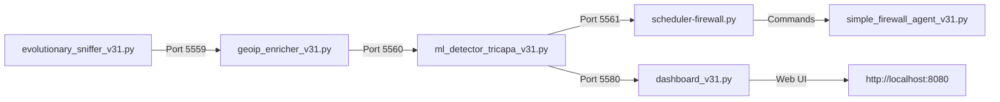
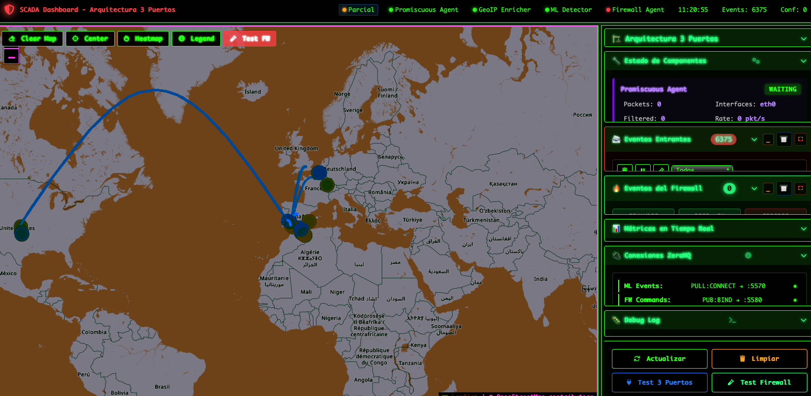
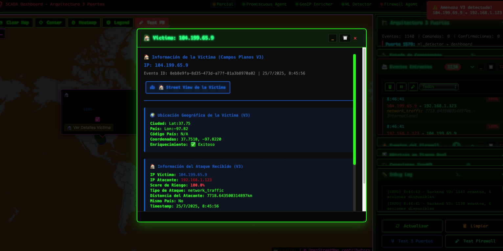
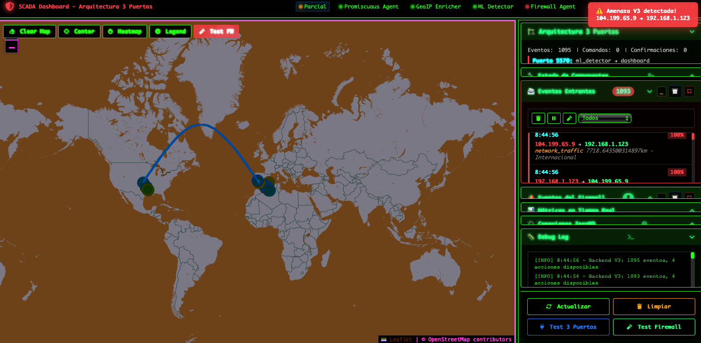
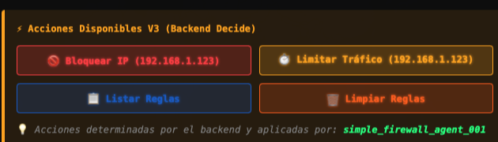
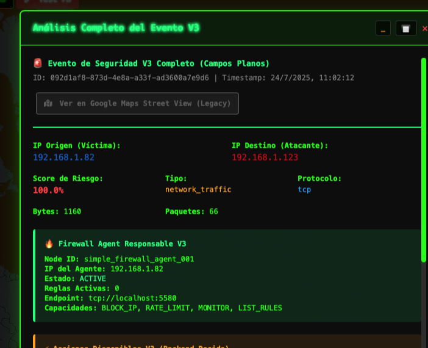
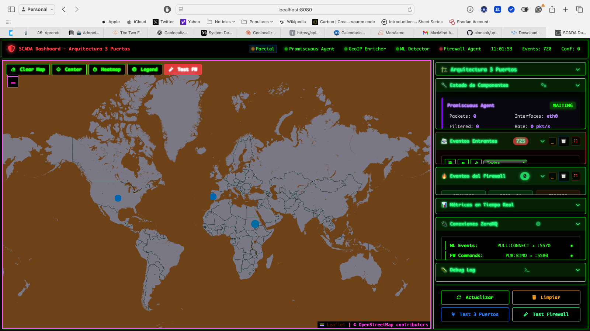
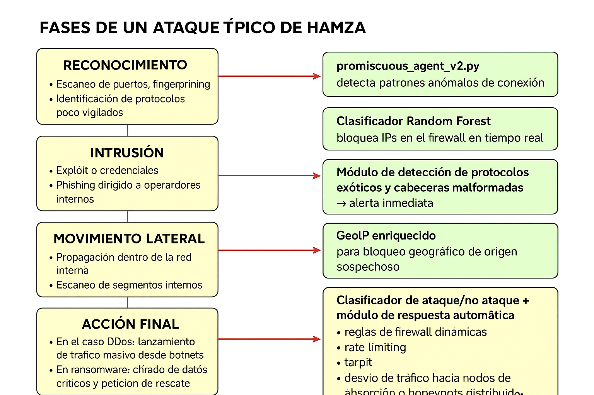

# 🧬 Upgraded Happiness - Sistema Autoinmune Digital V3.1

[](https://github.com/alonsoir/upgraded-happiness)
[](https://github.com/alonsoir/upgraded-happiness)
[](https://github.com/alonsoir/upgraded-happiness)
[](https://github.com/alonsoir/upgraded-happiness)

**Sistema de ciberseguridad adaptativa con IA tricapa y respuesta autónoma en tiempo real.**

## 🚀 Estado Actual del Proyecto

### ✅ **V3.1 - Versión Evolutiva (Producción)**
**Dashboard V3.1 COMPLETAMENTE FUNCIONAL** - Pipeline completo operativo con:
- 🗺️ **Mapa interactivo** con trayectorias de ataques en tiempo real
- 🎯 **1600+ eventos procesados** sin errores
- 🔥 **Firewall integrado** con botones de acción directa
- 🤖 **ML Tricapa** con 7 modelos operativos
- 📊 **Protobuf V3.1** con campos duales (source/target coordinates)

### 📚 **Demo Inicial** - Versión para Enseñanza/Demostración
Versión estable para mostrar conceptos y arquitectura base.

---

## 🏗️ Arquitectura V3.1

### **Pipeline Principal (V3.1)**

```mermaid
graph LR
    A[evolutionary_sniffer_v31.py] -->|Port 5559| B[geoip_enricher_v31.py]
    B -->|Port 5560| C[ml_detector_tricapa_v31.py]
    C -->|Port 5561| D[scheduler-firewall.py]
    D -->|Commands| E[simple_firewall_agent_v31.py]
    C -->|Port 5580| F[dashboard_v31.py]
    F -->|Web UI| G[http://localhost:8080]
```

### **Componentes V3.1**
| Componente | Función | Puerto | Estado |
|------------|---------|--------|--------|
| `evolutionary_sniffer_v31.py` | Captura de tráfico avanzada | 5559 | ✅ Operativo |
| `geoip_enricher_v31.py` | Enriquecimiento geográfico dual | 5560 | ✅ Operativo |
| `ml_detector_tricapa_v31.py` | IA tricapa + análisis ML | 5561 | ✅ Operativo |
| `scheduler-firewall.py` | Orquestador de firewall | - | ✅ Operativo |
| `simple_firewall_agent_v31.py` | Agente de firewall | 5562 | ✅ Operativo |
| `dashboard_v31.py` | Dashboard web V3.1 | 8080 | ✅ **FUNCIONAL** |

---

## ⚡ Inicio Rápido

### **🎯 V3.1 - Versión Evolutiva (Recomendado)**
```bash
# Setup completo
make quick_v31

# O paso a paso:
make setup install
make start_v31

# Dashboard V3.1
open http://localhost:8080
```

### **📚 Demo Inicial - Para Enseñanza**
```bash
# Versión demo estable
make start

# Dashboard demo
open http://localhost:8080
```

### **🛑 Parada**
```bash
# Parada normal
make stop

# Parada nuclear (ambas versiones)
make stop-nuclear
```

---

## 🤖 Sistema ML Tricapa

### **Modelos en Producción**
- **🔴 Nivel 1:** `rf_production_cicids.joblib` - Clasificación CICIDS2017
- **🟡 Nivel 2:** Detectores especializados (web/internal)  
- **🟢 Nivel 3:** Amenazas específicas (DDoS/Ransomware)

### **Features V3.1**
- ✅ **Coordenadas duales** - source_latitude/longitude + target_latitude/longitude
- ✅ **Protobuf V3.1** - network_security_clean_v31.proto
- ✅ **Ensemble confidence** - Scores de confianza ML mejorados
- ✅ **Pipeline latency tracking** - Monitoreo de rendimiento
- ✅ **Capturing node ID** - Trazabilidad distribuida

---

## 📊 Dashboard V3.1 - Funcionalidades

### **🗺️ Visualización**
- **Mapa interactivo** con OpenStreetMap + Leaflet
- **Trayectorias animadas** tipo misil entre source → target
- **Marcadores dinámicos** con información detallada
- **Google Maps integration** para vistas detalladas

### **🔥 Firewall Integrado**
- **Botones de acción directa** - Block IP, Rate Limit, etc.
- **Estados en tiempo real** - 1600+ eventos procesados
- **Modales draggables** - UX avanzada
- **Fleet management** - Gestión de múltiples agentes

### **📈 Análisis**
- **ML Scores en vivo** - Isolation Forest, SVM, LOF
- **Ensemble confidence** - Predicciones consolidadas
- **Pipeline metrics** - Latencia y throughput
- **Geographic analysis** - Distancias y correlaciones

---

## 🔧 Comandos Principales

### **Gestión del Sistema**
```bash
# V3.1 - Versión evolutiva
make start_v31              # Iniciar pipeline V3.1
make status_v31              # Estado componentes V3.1
make monitor_v31             # Monitor tiempo real V3.1

# Demo - Versión enseñanza
make start                   # Iniciar demo
make status                  # Estado demo

# Utilidades
make stop                    # Parada normal
make stop-nuclear            # Parada nuclear (ambas versiones)
make logs                    # Ver logs
make quick_v31               # Setup + start V3.1 completo
```

### **Desarrollo**
```bash
make compile-protobuf        # Compilar protobuf V3.1
make check-deps              # Verificar dependencias
make verify                  # Verificar integridad
make debug                   # Modo debug
```

---

## 📋 Configuración

### **Archivos de Configuración V3.1**
```
config/json/
├── evolutionary_sniffer_config_v31.json
├── geoip_enricher_config_v31.json
├── lightweight_ml_detector_tricapa_v31_config_dev.json
├── scheduler_firewall_config.json
├── simple_firewall_agent_v31_config.json
├── dashboard_config_v31.json
└── firewall_rules_v31.json
```

### **Modelos ML**
```
models/production/tricapa/
├── rf_production_cicids.joblib
├── web_normal_detector.joblib
├── internal_normal_detector.joblib
├── ddos_random_forest.joblib
├── ddos_lightgbm.joblib
├── ransomware_random_forest.joblib
└── ransomware_lightgbm.joblib
```

---

## 🌐 API y Endpoints

### **Dashboard V3.1**
- **Web UI:** `http://localhost:8080`
- **API Metrics:** `http://localhost:8080/api/metrics`
- **Firewall Actions:** `http://localhost:8080/api/execute-firewall-action`

### **ZeroMQ Ports**
- **5559:** Sniffer → GeoIP
- **5560:** GeoIP → ML Detector  
- **5561:** ML → Scheduler
- **5562:** Firewall Agent
- **5580:** ML → Dashboard (V3.1)

---

## 🔬 Desarrollo y Pruebas

### **Tests**
```bash
make test                    # Tests generales
make test-pipeline           # Test pipeline completo
make benchmark               # Benchmark rendimiento
```

### **Monitorización**
```bash
make monitor_v31             # Monitor V3.1 avanzado
make logs-tail               # Seguimiento logs tiempo real
make logs-errors             # Solo errores
```

---

## 🚀 Roadmap

### **✅ Completado (V3.1)**
- ✅ Dashboard V3.1 completamente funcional
- ✅ Pipeline V3.1 con protobuf actualizado
- ✅ Mapa interactivo con trayectorias
- ✅ Firewall integrado operativo
- ✅ ML Tricapa con 7 modelos
- ✅ 1600+ eventos procesados sin errores

### **🔄 En Desarrollo**
- 🔄 Content Security Policy optimization
- 🔄 Advanced threat analytics
- 🔄 Multi-node distributed deployment

### **🎯 Próximo (Q4 2025)**
- 🎯 Kubernetes deployment
- 🎯 Advanced ML retraining
- 🎯 API REST completa
- 🎯 Mobile dashboard

---

## 📚 Documentación

### **Enlaces Principales**
- 📖 [Wiki del Proyecto](https://github.com/alonsoir/upgraded-happiness/wiki)
- 🏗️ [Arquitectura Detallada](docs/architecture.md)
- 🤖 [ML Models Documentation](docs/ml-models.md)
- 🔧 [Deployment Guide](docs/deployment.md)

### **Soporte**
- 🐛 [Issues](https://github.com/alonsoir/upgraded-happiness/issues)
- 💬 [Discussions](https://github.com/alonsoir/upgraded-happiness/discussions)

---

## 🏆 Logros del Proyecto

### **🎉 Hitos Técnicos**
- **142 archivos organizados** sin pérdidas
- **7 modelos ML tricapa** operativos en producción
- **329 sitios globales** para generación de tráfico
- **Pipeline V3.1** completamente funcional
- **Dashboard interactivo** con 1600+ eventos procesados

### **💎 Joyas Técnicas**
- `fixed_service_sniffer.py` - Demostración del 90% del proyecto
- Sistema de coordenadas duales source/target
- Fleet management distribuido
- Ensemble confidence scoring
- Pipeline latency tracking

---

## 📄 Licencia

Este proyecto está licenciado bajo la MIT License - ver el archivo [LICENSE](LICENSE) para detalles.

---

## 🤝 Contribución

Las contribuciones son bienvenidas! Por favor lee [CONTRIBUTING.md](CONTRIBUTING.md) para detalles sobre nuestro código de conducta y el proceso para enviar pull requests.

---

**🧬 Upgraded Happiness - Sistema Autoinmune Digital V3.1**  
*Defending the digital ecosystem with adaptive AI*

---

## 📊 Estado Actual

```
┌─────────────────────────────────────────────────────────────┐
│                    🧬 SISTEMA V3.1 STATUS                  │
├─────────────────────────────────────────────────────────────┤
│ Pipeline V3.1:           ✅ OPERATIVO                      │
│ Dashboard V3.1:          ✅ FUNCIONAL (1600+ eventos)      │
│ ML Tricapa:              ✅ 7 MODELOS ACTIVOS              │
│ Firewall Integration:    ✅ CLICK-TO-BLOCK                 │
│ Mapa Interactivo:        ✅ TRAYECTORIAS ANIMADAS          │
│ Protobuf V3.1:           ✅ DUAL COORDINATES               │
│                                                             │
│ 🎯 READY FOR PRODUCTION                                    │
└─────────────────────────────────────────────────────────────┘
```






