# 🛡️ Upgraded Happiness - SCADA Security Platform

**Advanced Real-time Network Security System with ML-Powered Threat Detection and Automated Firewall Response**


## 🚀 **NEW: Automated Firewall Response System**

Upgraded Happiness now includes a **complete automated firewall response system** that detects threats in real-time and automatically blocks malicious IPs through an intelligent, ML-powered dashboard.

### ⚡ Quick Start (Firewall System)

```bash
# 1. Setup and install dependencies
make setup-firewall-perms
make install-firewall-deps

# 2. Start the complete firewall system
make run-firewall

# 3. Open interactive dashboard
make show-firewall-dashboard
```

**🎯 Access the dashboard at:** http://localhost:8000

---

## 📋 Table of Contents

- [🎯 System Overview](#-system-overview)
- [🔥 Firewall System (NEW)](#-firewall-system-new)
- [🏗️ Architecture](#️-architecture)  
- [📦 Installation](#-installation)
- [🚀 Usage](#-usage)
- [🌍 GIS Dashboard (Legacy)](#-gis-dashboard-legacy)
- [🧪 Testing](#-testing)
- [📊 Monitoring](#-monitoring)
- [🔧 Configuration](#-configuration)
- [🐋 Docker Deployment (Future)](#-docker-deployment-future)
- [🤝 Contributing](#-contributing)

---

## 🎯 System Overview

Upgraded Happiness is a comprehensive **SCADA (Supervisory Control and Data Acquisition) security platform** that provides:

### 🔥 **Core Features (Enhanced)**

- **🚨 Real-time Threat Detection**: ML-powered analysis of network traffic
- **🛡️ Automated Firewall Response**: Click-to-block malicious IPs with intelligent command generation
- **📊 Interactive Dashboard**: Real-time visualization with geographic mapping
- **🤖 Machine Learning**: Multiple ML models for anomaly and risk detection
- **🗺️ Geographic Intelligence**: IP geolocation with interactive maps
- **⚡ High Performance**: ZeroMQ-based messaging for real-time processing
- **🔧 Multi-Platform**: Linux, macOS, and Windows support

### 🎯 **New Capabilities**

| Feature | Description | Status |
|---------|-------------|---------|
| **Automated Blocking** | Click events to instantly block IPs | ✅ Production |
| **Intelligent Commands** | Context-aware firewall rule generation | ✅ Production |
| **Temporal Management** | Auto-expiring firewall rules | ✅ Production |
| **Claude Integration** | AI-powered command optimization | 🔄 Beta |
| **Multi-Platform Firewall** | iptables, pfctl, netsh support | ✅ Production |

---

## 🔥 Firewall System (NEW)

### 🎯 **Architecture Flow**

```mermaid
graph TD
    A[📡 Promiscuous Agent] -->|Port 5559| B[🤖 ML Detector]
    B -->|Port 5560| C[📊 Interactive Dashboard]
    C -->|Port 5561| D[🔥 Firewall Agent]
    D -->|iptables/pfctl| E[🛡️ System Firewall]
    C -->|Web UI| F[👤 Security Operator]
```



### 🎮 **Interactive Features**

#### 1. **Click-to-Block Events**
- Click any high-risk event in the dashboard
- Automatic firewall command generation
- Confirmation modal with command preview
- One-click deployment to system firewall

#### 2. **Intelligent Command Generation**
```javascript
// Example: SSH Brute Force Detection
Event: 192.168.1.100 → 10.0.0.1:22 (Risk: 85%)
Generated Command: 
  iptables -A INPUT -s 192.168.1.100 -p tcp --dport 22 -m limit --limit 3/min -j ACCEPT
  iptables -A INPUT -s 192.168.1.100 -p tcp --dport 22 -j DROP
Duration: 24h (High Risk)
```

#### 3. **Temporal Rule Management**
- Automatic rule expiration
- Cleanup of outdated rules
- Rollback on errors
- Audit trail of all actions

### 🚀 **Firewall System Usage**

#### **Option A: One-Command Start**
```bash
make run-firewall
```

#### **Option B: Manual Component Start**
```bash
# Terminal 1: Firewall Agent (must be first!)
python firewall_agent.py

# Terminal 2: Packet Capture
sudo python promiscuous_agent.py enhanced_agent_config.json

# Terminal 3: ML Analysis
python ml_detector_with_persistence.py

# Terminal 4: Interactive Dashboard
python real_zmq_dashboard_with_firewall.py
```

#### **Option C: Background Mode**
```bash
make run-firewall-bg
```

### 📊 **Dashboard Features**

- **🗺️ Real-time Event Map**: Geographic visualization of threats
- **📋 Event List**: Clickable events with risk scoring
- **🛡️ Firewall Controls**: One-click blocking with intelligent commands
- **📈 Live Statistics**: Events/minute, anomalies, high-risk events
- **🔍 Event Details**: Complete packet analysis and ML scores
- **📜 Action Log**: History of all firewall commands executed

---

## 🏗️ Architecture

### 🔄 **Data Flow**

```
Network Traffic → Promiscuous Capture → ML Analysis → Dashboard → Firewall Response
      ↓                ↓                    ↓           ↓            ↓
   Raw Packets    Protobuf Events    Enhanced Events  User Action  iptables Rules
```

### 📦 **Component Architecture**

#### **Core Components**
1. **Promiscuous Agent** (`promiscuous_agent.py`)
   - Captures network packets in promiscuous mode
   - Converts to protobuf format
   - Sends to ML Detector via port 5559

2. **ML Detector** (`ml_detector_with_persistence.py`)
   - Receives raw events from port 5559
   - Applies 6 different ML models
   - Enriches events with risk and anomaly scores
   - Forwards enhanced events to port 5560

3. **Interactive Dashboard** (`real_zmq_dashboard_with_firewall.py`)
   - Receives enhanced events from port 5560
   - Provides web interface with real-time updates
   - Generates firewall commands for high-risk events
   - Sends commands to Firewall Agent via port 5561

4. **Firewall Agent** (`firewall_agent.py`)
   - Receives firewall commands from port 5561
   - Applies rules to system firewall
   - Manages rule expiration and cleanup
   - Provides audit logging

#### **Support Components**
- **Claude Integration** (`claude_firewall_integration.py`): AI-powered command generation
- **System Orchestrator** (`system_orchestrator.py`): Automated system management
- **GPS Generator** (`generate_gps_traffic.py`): Test data with geographic coordinates

### 🌐 **Network Ports**

| Port | Component | Direction | Purpose |
|------|-----------|-----------|---------|
| 5559 | ML Detector | ← Agent | Raw packet events |
| 5560 | Dashboard | ← ML | Enhanced events with ML scores |
| 5561 | Firewall Agent | ← Dashboard | Firewall commands |
| 8000 | Dashboard | ← Browser | Web interface |

---

## 📦 Installation

### 🔧 **Prerequisites**

```bash
# System requirements
Python 3.8+
sudo access (for packet capture and firewall)
Virtual environment support

# Platform-specific
Linux: iptables
macOS: pfctl  
Windows: netsh
```

### 📥 **Quick Installation**

```bash
# Clone repository
git clone <repository-url>
cd upgraded-happiness

# Setup virtual environment and dependencies
make setup
make install-all

# Configure firewall permissions (Linux/macOS)
make setup-firewall-perms

# Verify installation
make verify-firewall
```

### 📋 **Manual Installation**

```bash
# 1. Create virtual environment
python3 -m venv upgraded_happiness_venv
source upgraded_happiness_venv/bin/activate

# 2. Install dependencies
pip install -r requirements.txt
pip install zmq psutil scikit-learn

# 3. Configure firewall permissions
sudo visudo
# Add: your_user ALL=(ALL) NOPASSWD: /sbin/iptables

# 4. Verify protobuf files
ls src/protocols/protobuf/network_event_pb2.py
```

---

## 🚀 Usage

### 🎯 **Firewall System (Primary)**

#### **Start Complete System**
```bash
make run-firewall
```
This starts all components in the correct order and opens the dashboard.

#### **Monitor System Status**
```bash
make status-firewall
make monitor-firewall
```

#### **Test Firewall Functionality**
```bash
make test-firewall
make test-claude
```

### 🌍 **Legacy GIS System**

#### **Start GIS Dashboard**
```bash
make run-enhanced  # Complete legacy system
make gis          # GIS dashboard only
```

### 🛠️ **System Management**

#### **Stop Systems**
```bash
make stop-firewall    # Stop firewall system only
make stop            # Nuclear stop (all components)
make emergency-stop  # Force kill all processes
```

#### **View Logs**
```bash
make logs-firewall   # Firewall system logs
make logs-gis       # GIS system logs
make show-logs      # All logs (live)
```

### 🧪 **Development Mode**

```bash
# Start individual components for development
python firewall_agent.py
python real_zmq_dashboard_with_firewall.py
python claude_firewall_integration.py  # Test AI integration
```

---

## 🌍 GIS Dashboard (Legacy)

The original GIS dashboard provides geographic visualization without firewall capabilities.

### 🚀 **Legacy Quick Start**
```bash
make run-enhanced
```

### 🔗 **Legacy URLs**
- **GIS Dashboard**: http://localhost:8001
- **Fixed Dashboard**: http://localhost:8766

### 🎯 **Legacy Features**
- Real-time IP geolocation
- Interactive Leaflet maps
- WebSocket updates
- Event visualization
- Basic anomaly detection

---

## 🧪 Testing

### 🔬 **Firewall System Tests**

```bash
# Test complete firewall system
make test-firewall

# Test individual components
make test-claude
python claude_firewall_integration.py

# Test with sample data
make run-firewall-test
```

### 🗺️ **GIS System Tests**

```bash
# Test GIS functionality
make test-gis
make test-geolocation
```

### 🎯 **Manual Testing**

#### **Generate Test Events**
```bash
# Start system with GPS test data
make run-firewall-test

# Manual event injection
python generate_gps_traffic.py continuous 15
```

#### **Test Firewall Commands**
```bash
# Send test command to firewall agent
python -c "
import zmq, json
context = zmq.Context()
socket = context.socket(zmq.PUSH) 
socket.connect('tcp://localhost:5561')
socket.send(json.dumps({
    'action': 'block_ip',
    'target_ip': '192.168.1.100',
    'reason': 'Test command'
}).encode())
"
```

---

## 📊 Monitoring

### 📈 **System Metrics**

#### **Real-time Dashboard**
- Events per minute
- ML anomaly detection rate
- High-risk event count
- Firewall rules active
- Geographic event distribution

#### **Command Line Monitoring**
```bash
# System status
make status-firewall
make monitor-firewall

# Performance monitoring
watch -n 2 "make status-firewall"

# Log monitoring
tail -f logs/firewall_agent.out
tail -f logs/firewall_dashboard.out
```

### 🔍 **Health Checks**

```bash
# Verify all components
make verify-firewall

# Test connectivity
curl http://localhost:8000/health
curl http://localhost:8000/api/stats

# Check firewall status
curl http://localhost:8000/api/firewall/log
```

### 📋 **Logging**

#### **Log Files**
```
logs/
├── firewall_agent.out      # Firewall agent operations
├── firewall_dashboard.out  # Dashboard activity  
├── ml.out                  # ML detector processing
├── agent.out               # Packet capture
└── gps_generator.out       # Test data generation
```

#### **Log Levels**
- `INFO`: Normal operations
- `WARNING`: Non-critical issues
- `ERROR`: Component failures
- `DEBUG`: Detailed troubleshooting

---

## 🔧 Configuration

### 🌍 **Environment Variables**

The system uses a comprehensive `.env` file for configuration:

```bash
# Firewall System
FIREWALL_COMMAND_PORT=5561
FIREWALL_DASHBOARD_PORT=8000
FIREWALL_DEFAULT_BLOCK_DURATION=1h

# ML Configuration  
ML_ANOMALY_THRESHOLD=0.7
ML_RISK_THRESHOLD=0.8
ML_HIGH_RISK_THRESHOLD=0.9

# Network Capture
CAPTURE_PORT=5559
ML_ENHANCED_PORT=5560

# Dashboard
DASHBOARD_REFRESH_INTERVAL=3000
DASHBOARD_MAX_EVENTS_DISPLAY=300
```

### 🔧 **Component Configuration**

#### **Promiscuous Agent**
```json
// enhanced_agent_config.json
{
  "interface": "auto",
  "buffer_size": 1024,
  "timeout": 1,
  "output_port": 5559
}
```

#### **ML Detector**
```python
# Built-in configuration
MODELS = [
    'IsolationForest',
    'OneClassSVM', 
    'EllipticEnvelope',
    'LocalOutlierFactor',
    'RandomForest',
    'XGBoost'
]
```

#### **Firewall Agent**
```python
# Automatic rule expiration
RULE_CHECK_INTERVAL = 60  # seconds
MAX_ACTIVE_RULES = 100
SUDO_TIMEOUT = 30
```

---

## 🐋 Docker Deployment (Future)

### 🚢 **Containerized Architecture** 

```yaml
# docker-compose.yml (Future)
version: '3.8'
services:
  firewall-agent:
    build: ./docker/firewall.Dockerfile
    ports: ["5561:5561"]
    
  ml-detector:
    build: ./docker/ml.Dockerfile
    ports: ["5559:5559", "5560:5560"]
    
  dashboard:
    build: ./docker/dashboard.Dockerfile  
    ports: ["8000:8000"]
    
  capture-agent:
    build: ./docker/agent.Dockerfile
    network_mode: host
    privileged: true
```

### 🎯 **Deployment Commands**
```bash
# Future deployment
docker-compose up -d
docker-compose ps
docker-compose logs -f firewall-agent
```

---

## 🤝 Contributing

### 🛠️ **Development Setup**

```bash
# Development environment
make setup
make install-dev
make test

# Pre-commit hooks
pip install pre-commit
pre-commit install
```

### 📝 **Code Standards**

- **Python**: PEP 8, Black formatting
- **JavaScript**: ES6+, Prettier formatting  
- **Documentation**: Inline comments + README updates
- **Testing**: Unit tests for new features

### 🔄 **Pull Request Process**

1. Fork the repository
2. Create feature branch (`git checkout -b feature/amazing-feature`)
3. Commit changes (`git commit -m 'Add amazing feature'`)
4. Push to branch (`git push origin feature/amazing-feature`)
5. Open Pull Request

### 🧪 **Testing Requirements**

```bash
# Required tests for firewall features
make test-firewall
make test-claude

# Performance testing
make monitor-firewall

# Integration testing
make run-firewall-test
```

---

## 📄 License

This project is licensed under the MIT License - see the [LICENSE](LICENSE) file for details.

---

## 🙏 Acknowledgments

- **ZeroMQ**: High-performance messaging
- **Scikit-learn**: Machine learning models
- **Leaflet**: Interactive mapping
- **FastAPI**: Modern web framework
- **Claude**: AI-powered intelligence (future)

---

## 📞 Support

### 🆘 **Quick Help**

```bash
# View all available commands
make help
make help-firewall
make help-gis

# Diagnostic information
make diagnose
make verify-firewall

# Emergency recovery
make emergency-fix
make emergency-stop
```

### 📧 **Contact**

- **Issues**: [GitHub Issues](link-to-issues)
- **Discussions**: [GitHub Discussions](link-to-discussions)  
- **Security**: security@upgraded-happiness.com

---

## 🗺️ Roadmap

### 🎯 **Current Focus**
- ✅ Automated firewall response system
- ✅ Interactive threat blocking
- ✅ Multi-platform firewall support
- ✅ Temporal rule management

### 🔮 **Next Phase**
- 🔄 Claude AI integration for smart commands
- 🔄 Container deployment with Docker
- 🔄 Advanced threat intelligence
- 🔄 Mobile dashboard app

### 🚀 **Future Vision**
- 📋 Multi-node deployment
- 📋 Advanced analytics and reporting
- 📋 Integration with SIEM systems
- 📋 Cloud-native architecture

---

**⚡ Ready to secure your network? Start with `make run-firewall`** 🛡️