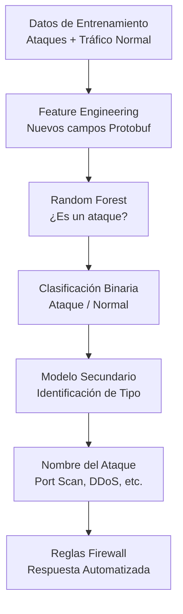
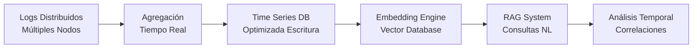
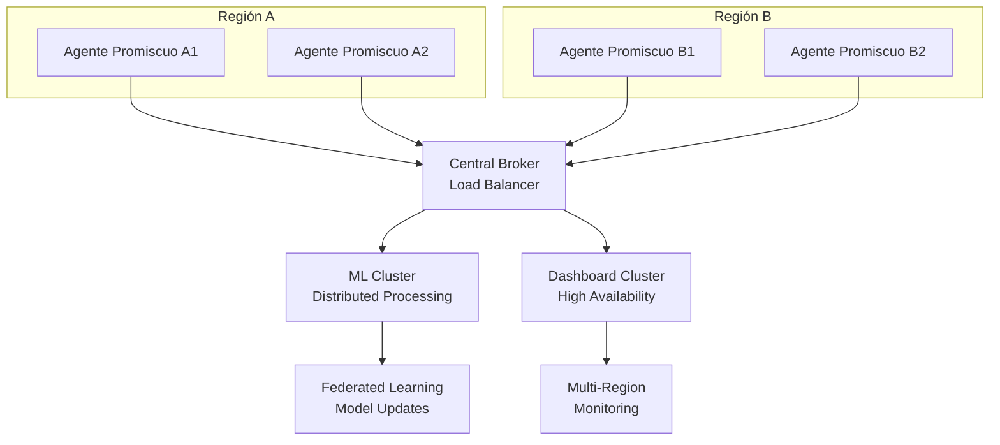

# 🗺️ ROADMAP - Upgraded Happiness

## 📅 **Estado Actual (Q2 2025) - ✅ COMPLETADO**

### 🎯 **Pipeline Completo Funcional**
- ✅ **Captura en tiempo real**: Agente promiscuo operativo con Scapy
- ✅ **Enriquecimiento de datos**: Procesamiento y análisis de eventos
- ✅ **Dashboard interactivo**: Visualización con animaciones + capacidad de interacción
- ✅ **Comunicación distribuida**: ZeroMQ broker estable (5555/5556)
- ✅ **Machine Learning**: 6 algoritmos entrenados y funcionando
- ✅ **Monitoreo avanzado**: Sistema de métricas en tiempo real

### ⚠️ **Limitaciones Identificadas**
- **Servicio GeoIP**: Limitado por versión freemium (pocas consultas/mes)
- **Escalabilidad**: Sistema monolítico, necesita distribución
- **Persistencia**: Almacenamiento temporal, falta base de datos time-series

---

## 🔮 **Futuro Inmediato (Q3-Q4 2025)**

### 🧠 **1. Sistema de Machine Learning Avanzado**

#### 🎯 **Modelo Principal: Random Forest para Detección de Ataques**


**Objetivos específicos:**
- **Primer modelo RF**: Clasificación binaria (¿es ataque? sí/no)
- **Segundo modelo**: Identificación específica del tipo de ataque
- **Training data**: Datasets de calidad con ataques etiquetados vs tráfico normal
- **Respuesta automática**: Generación de reglas de firewall específicas

#### 🔧 **Nuevo Protobuf Schema**
```protobuf
message NetworkEvent {
  // Campos existentes
  string timestamp = 1;
  string src_ip = 2;
  string dst_ip = 3;
  
  // NUEVOS CAMPOS para ML
  PacketFeatures packet_features = 4;
  FlowStatistics flow_stats = 5;
  ProtocolAnalysis protocol_analysis = 6;
  TimeSeriesFeatures time_features = 7;
}

message PacketFeatures {
  int32 packet_size = 1;
  int32 header_length = 2;
  repeated string flags = 3;
  int32 payload_entropy = 4;  // Para detectar cifrado/compresión
}

message FlowStatistics {
  int32 packets_per_second = 1;
  int32 bytes_per_second = 2;
  float inter_arrival_time = 3;
  int32 flow_duration = 4;
}
```

**Implementación:**
- Captura de nuevos campos en `promiscuous_agent.py` mediante Scapy
- Enriquecimiento de features antes del ML processing
- Compatibilidad hacia atrás con schema actual

---

### 🗄️ **2. Sistema RAG para Análisis de Logs**

#### 📊 **Time Series Database**


**Objetivos:**
- **Base de datos time-series**: Optimizada para escrituras masivas (logs continuos)
- **Agregación en tiempo real**: Consolidación de logs distribuidos
- **Embeddings**: Vectorización de eventos para búsqueda semántica
- **RAG Interface**: Consultas en lenguaje natural sobre comportamiento del sistema

#### 🔍 **Capacidades del RAG**
- **Consultas naturales**: "¿Qué eventos inusuales ocurrieron entre las 14:00 y 16:00?"
- **Análisis temporal**: "Muéstrame la correlación entre estos eventos"
- **Retroceso temporal**: "Retrocede 2 horas y encuentra eventos relacionados"
- **Detección de patrones**: "¿Ha ocurrido algo similar anteriormente?"

**Stack tecnológico:**
- **Time Series DB**: InfluxDB / TimescaleDB
- **Vector DB**: Chroma / Pinecone
- **Embedding**: OpenAI Embeddings / SentenceTransformers
- **RAG Framework**: LangChain / LlamaIndex

---

## 🚀 **Futuro Medio Plazo (2026)**

### 🌐 **3. Arquitectura Distribuida**

#### 🔄 **Multi-Agent System**


**Características:**
- **Múltiples agentes**: Red distribuida de sensores
- **Load balancing**: Distribución inteligente de carga
- **High availability**: Redundancia y failover automático
- **Federated learning**: Modelos que aprenden de múltiples regiones

### 🔒 **4. Sistema de Respuesta Automatizada**

#### ⚡ **Respuesta en Tiempo Real**
- **Firewall automático**: Generación de reglas basadas en ML
- **Aislamiento de red**: Cuarentena automática de hosts comprometidos
- **Alertas escalonadas**: Notificaciones por criticidad
- **Playbooks automatizados**: Respuestas predefinidas por tipo de ataque

---

## 🔬 **Futuro Largo Plazo (2027+)**

### 🧪 **5. Investigación Avanzada**

#### 🤖 **AI/ML Avanzado**
- **Deep Learning**: Redes neuronales para detección de amenazas complejas
- **Anomaly Detection**: Autoencoders para patrones nunca vistos
- **Predictive Analytics**: Predicción de ataques antes de que ocurran
- **Behavioral Analysis**: Perfiles de comportamiento por usuario/dispositivo

#### 🔍 **Forensia Digital**
- **Timeline reconstruction**: Reconstrucción completa de eventos
- **Attack attribution**: Identificación de atacantes
- **Evidence collection**: Recolección automática de evidencia digital
- **Chain of custody**: Trazabilidad legal de evidencia

#### 🌍 **Expansión de Cobertura**
- **IoT Integration**: Monitoreo de dispositivos IoT/OT
- **Cloud native**: Despliegue en Kubernetes
- **Multi-cloud**: Operación en múltiples proveedores cloud
- **Edge computing**: Procesamiento en el borde de la red

---

## 📊 **Métricas de Éxito**

### 🎯 **Objetivos Cuantitativos**

| Métrica | Actual | Q4 2025 | 2026 | 2027+ |
|---------|--------|---------|------|-------|
| **Precisión ML** | 85% | 95% | 98% | 99%+ |
| **Falsos Positivos** | 10% | 3% | 1% | <0.5% |
| **Tiempo Respuesta** | <10ms | <5ms | <1ms | <0.5ms |
| **Escalabilidad** | 1 agente | 10 agentes | 100+ agentes | 1000+ agentes |
| **Uptime** | 95% | 99% | 99.9% | 99.99% |

### 🔍 **Indicadores Cualitativos**
- **Usabilidad**: Dashboard intuitivo y fácil de usar
- **Mantenibilidad**: Código limpio y bien documentado
- **Seguridad**: Cumplimiento con estándares de ciberseguridad
- **Interoperabilidad**: Integración con sistemas existentes

---

## 🛠️ **Prioridades de Desarrollo**

### 🥇 **Prioridad Alta (Q3 2025)**
1. **Nuevo schema Protobuf** con campos para ML
2. **Random Forest model** para detección binaria
3. **Modelo de clasificación** de tipos de ataque
4. **Time series database** setup

### 🥈 **Prioridad Media (Q4 2025)**
1. **RAG system** implementación básica
2. **Embedding engine** para logs
3. **Consultas en lenguaje natural**
4. **Respuesta automatizada** básica

### 🥉 **Prioridad Baja (2026)**
1. **Arquitectura distribuida**
2. **Multiple agents** deployment
3. **Federated learning**
4. **Advanced forensics**

---

## 💡 **Consideraciones Técnicas**

### 🔧 **Challenges Esperados**
- **Calidad de datos**: Obtener datasets de entrenamiento de calidad
- **Latencia vs Precisión**: Balance entre velocidad y exactitud
- **Escalabilidad**: Mantener performance con múltiples agentes
- **Compatibilidad**: Backward compatibility durante upgrades

### 📈 **Recursos Necesarios**
- **Hardware**: Servidores con GPUs para ML training
- **Datasets**: Acceso a datos de ataques reales
- **Expertise**: Especialistas en ML y ciberseguridad
- **Tiempo**: Desarrollo incremental por fases

---

**🎯 Objetivo Final**: Crear la plataforma de ciberseguridad SCADA más avanzada, con capacidades de detección predictiva, respuesta automatizada y análisis forense completo, protegiendo infraestructuras críticas mediante inteligencia artificial de última generación.